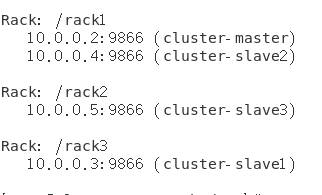

## HADOOP基础   HDFS原理

​		Hadoop是Apache软件基金会开发的一款并行计算框架和分布式文件管理系统。其核心模块包括HDFS，Hadoop common，MapReduce。这里我们简要的介绍HDFS系统，分析其基本架构、原理，本文只涉及HDFS的理论部分，后续将给出详细的HDFS搭建步骤。

### 一、HDFS介绍

在当前的工作和研究的环境下，单机容量往往无法满足存储的需要，大量的数据的存储需要跨机器实现，hadoop就是针对这些问题的一个框架。我们利用hadoop建立集群后，统一管理分布在集群上的文件系统叫做**分布式文件系统**（HDFS系统）。为达到目的，不免在系统中引入网络，随之也引入了网络编程的复杂性，例如需要保证在节点不可用的时候数据不会丢失。

HDFS，是Hadoop Distributed File System的简称，它是Hadoop的一个子项目，也是Hadoop抽象文件系统的一种实现。Hadoop抽象文件系统可以与本地系统、Amazon S3等集成，甚至可以通过Web协议（webhsfs）来操作。HDFS的文件分布在集群机器上，同时提供副本进行容错及可靠性保证。例如客户端写入读取文件的直接操作都是分布在集群各个机器上的，没有单点性能压力。

### 二、设计目标

- **大规模数据集**

运行在HDFS上的应用具有很大的数据集，其典型文件的大小常是GB甚至TB字节。因此HDFS应该能提供整体上高的数据传输带宽，能在一个集群里扩展到数百个节点。这类文件一般需要**高吞吐量**，且对延时没有要求

- **流式数据访问**

运行在HFDS上的应用需要流式访问他们的数据集，因此HDFS设计中更多的考虑到了数据批处理，而不是用户交互处理。HDFS基于这样的一个假设：最有效的数据处理模式是**一次写入、多次读取**。数据集经常由数据源生成或者拷贝一次后在其上做很多分析工作。分析工作经常读取其中的大部分数据，因此读取整个数据集所需时间比读取第一条记录的延时更重要。

- **硬件错误检测和快速恢复**

HDFS可能是由成百上千的服务器构成的，每个服务器上存储着文件系统的部分数据，构成系统的组件数目也是巨大的，任意一个组件都有失效的可能，总有一部分HDFS组件不工作。

- **简单的一致性模型**

HDFS应用需要一个“一次写入多次读取”的文件访问模型。一个文件经过创建、写入和关闭之后就不需要改变。这一假设简化了数据一致性问题，并且使高吞吐量的数据访问成为可能。Map/Reduce应用或者网络爬虫应用都非常适合这个模型。目前还有计划在将来扩充这个模型，使之支持文件的附加写操作。

### 三、HDFS架构

HDFS是一个主从体系结构，它由四部分组成，分别是HDFS Client、NameNode、DataNode以及Seconary NameNode

一个HDFS集群是由一个Namenode和一定数目的Datanodes组成。Namenode是一个中心服务器，负责构建命名空间和管理文件的元数据。集群中的Datanode一般是一个节点一个，负责管理它所在节点上的存储。HDFS暴露了文件系统的名字空间，用户能够以文件的形式在上面存储数据。从内部看，一个文件其实被分成一个或多个数据块，这些块存储在一组Datanode上。Namenode执行文件系统的名字空间操作，比如打开、关闭、重命名文件或目录。它也负责确定数据块到具体Datanode节点的映射。Datanode负责处理文件系统客户端的读写请求。在Namenode的统一调度下进行数据块的创建、删除和复制。

#### 3.1 Blocks

HDFS作为分布式存储的试下

物理磁盘中有块的概念，磁盘的物理Block是磁盘操作最小的单元，读写操作也都以Block为最小单元，一般为512 Byte。文件系统在物理Block之上抽象了另一层概念，文件系统Block物理磁盘Block的整数倍。通常为几KB。Hadoop提供的df、fsck这类运维工具都是在文件系统的Block级别上进行操作。

HDFS的Block块比一般单机文件系统大得多，默认为128M。HDFS的文件被拆分成block-sized的chunk，chunk作为独立单元存储。比Block小的文件不会占用整个Block，只会占据实际大小。例如， 如果一个文件大小为1M，则在HDFS中只会占用1M的空间，而不是128M。

**为什么block的大小要这样设置？**

这样设置是为了最小化查找（seek）时间，控制定位文件与传输文件所用的时间比例。假设定位到Block所需的时间为10ms，磁盘传输速度为100M/s。如果要将定位到Block所用时间占传输时间的比例控制1%，则Block大小需要约100M。 
但是如果Block设置过大，在MapReduce任务中，Map或者Reduce任务的个数 如果小于集群机器数量，会使得作业运行效率很低

**Block抽象的好处** 
block的拆分使得单个文件大小可以大于整个磁盘的容量，构成文件的Block可以分布在整个集群， 理论上，单个文件可以占据集群中所有机器的磁盘。 
Block的抽象也简化了存储系统，对于Block，无需关注其权限，所有者等内容（这些内容都在文件级别上进行控制）。 
Block作为容错和高可用机制中的副本单元，以Block为单位进行复制。

#### 3.2 Client

- 客户端会对文件进行切分，分成一个个block进行存储。
- 通过与NameNode进行交互获取文件的位置信息
- 通过与DataNode进行交互读取写入数据
- 客户端本身提供命令用于管理访问HDFS，例如hdfs的开启和关闭

#### 3.3 Namenode

NameNode就是master，它是一个**管理者**，可以管理HDFS的名称空间、管理Block的映射信息，配置副本策略，处理客户端读写请求

Namenode存放文件系统树及所有文件、目录的元数据。元数据持久化为2种形式：

- namespcae image
- edit log

元数据信息包括文件名、文件目录结构、文件属性（生成时间，副本数，权限）每个文件的块列表。以及列表中块与块之间DataNode地址映射关系，在内存中加载文件系统中的每个文件和每个数据块的引用关系，数据会定期保存在本地磁盘（fslmage文件和edits文件）

但是持久化数据中不包括Block所在的节点列表，及文件的Block分布在集群中的哪些节点上，这些信息是在系统重启的时候重新构建（通过Datanode汇报的Block信息）。 
在HDFS中，Namenode可能成为集群的单点故障，Namenode不可用时，整个文件系统是不可用的。HDFS针对单点故障提供了2种解决机制： 
1）**备份持久化元数据** 
将文件系统的元数据同时写到多个文件系统， 例如同时将元数据写到本地文件系统及NFS。这些备份操作都是同步的、原子的。

2）**Secondary Namenode** 
Secondary节点定期合并主Namenode的namespace image和edit log， 避免edit log过大，通过创建检查点checkpoint来合并。它会维护一个合并后的namespace image副本， 可用于在Namenode完全崩溃时恢复数据。下图为Secondary Namenode的管理界面：

#### 3.4 DataNode

DataNode就是从节点，它只在NameNode的命令下进行两个工作：

1.存储实际的数据块(Blocks)

2.进行数据的读写

#### 3.5 Secondary NameNode

Secondary NameNode主要有以下的几个功能：

1. 辅助NameNode，帮助其完成任务。
2. 定期合fsimage和fsedits，推送给NameNode
3. 紧急情况下可辅助恢复需要

Ps.需要注意的是，它并不是NameNode的热备，在NameNode挂掉后不能立刻替换NameNode提供服务。

### 四、HDFS的副本机制和机架感知

#### 4.1 HDFS文件副本机制

hdfs文件都是以block的形式存放在文件系统中的，有以下的作用：

1. 一个文件大小可能会大于集群中任意一个磁盘，引入块可以避免存不下这个问题
2. 使用块作为文件存储的逻辑单位可以简化存储子系统
3. 块比较适合用来作为数据备份，从而提高数据容错能力

我们都知道随着计算机存储空间的增加，其价格也是指数级上涨的，出于成本的考量，我们更希望能够在几台价格相对低廉的机器上通过分布式的方法进行文件读写任务。由于这样的机器性能不算很好，就必须要把宕机纳入考虑的范畴。此时就要采取冗余数据存储，具体的实现就是副本机制，在多个节点上保存多个副本。

#### 4.2 HDFS文件机架感知

这里就涉及到了网络拓扑结构，HDFS采用了一很简单的方式去建立网络，把网络看成一棵树，把两个节点间的距离定义为二者到最近的共同祖先的距离的总和。距离有四种，从上到下依次为  数据中心——机架——节点——进程。因此在一个数据中心中，会设置几个机架，每个机架下又会设置多个节点，具体拓扑结构可通过命令行观测，这里我将个人实验过程中的截图放上，仅供参考。

##### 4.2.1 未设置机架

1.上传1GB文件到hdfs分布式文件系统

2.通过节点管理器观察副本存放策略

               设置机架前的副本存放

3.在当前机架下，上传1个大小为1G的记录上传时间为20s左右

4.配置机架

首先打印节点的拓扑结构

随后修改core-site.xml文件，根据老师所发教程创建机架

##### 4.2.2 设置机架后

图1.7.2.1 设置机架后的副本存放

与之对应的修改后的拓扑结构如下：

**副本分配策略：**

HDFS 分布式文件系统的内部有一个副本存放策略：以默认的副本数=3 为例：
 1、第一个副本块存本机
 2、第二个副本块存跟本机同机架内的其他服务器节点
 3、第三个副本块存不同机架的一个服务器节点上

通过设置机架感知，改变了拓扑结构，可以一定程度上提高文件读写的效率

