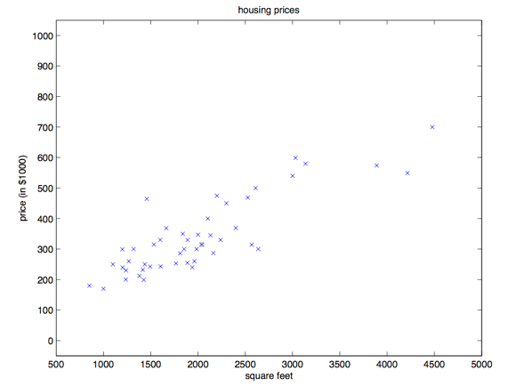
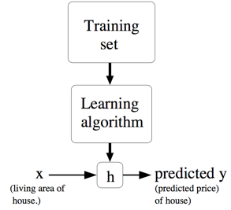
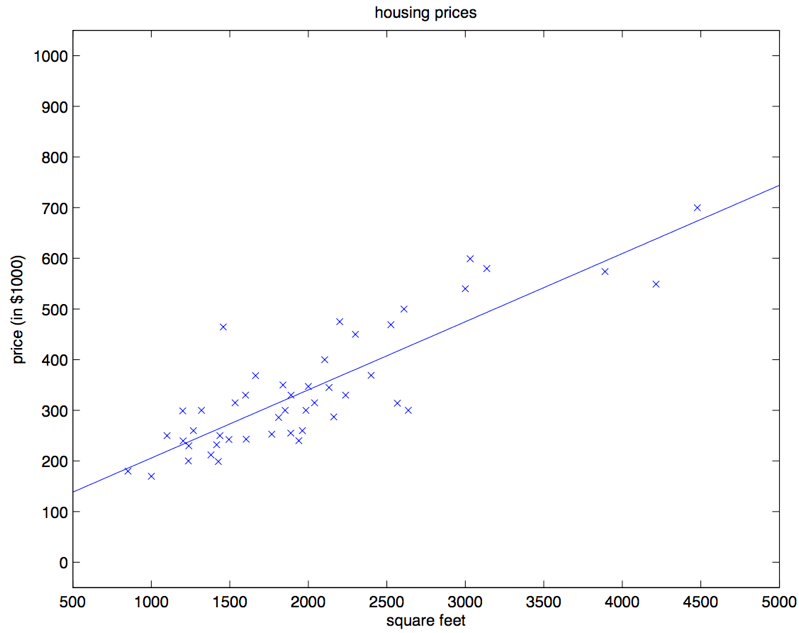

# 斯坦福CS229

# 课程笔记第一章（一）

## 监督学习（Supervised learning）

**定义：**根据已有的数据集，知道输入和输出结果之间的关系。根据这种已知的关系，训练得到一个最优的模型。在监督学习中训练数据既有特征(feature)又有标签(label)，通过训练，让机器可以自己找到特征和标签之间的联系，在面对只有特征没有标签的数据时，可以判断出标签，也就是完成测试。

房价预测是使用监督学习来解决问题的一个实例。假如有这样一个数据集，里面的数据是俄勒冈州波特兰市的 $47$ 套房屋的面积和价格，如下表所示：

| 居住面积（平方英尺） | 价格（千美元） |
| :------------------: | :------------: |
|        $2104$        |     $400$      |
|        $1600$        |     $330$      |
|        $2400$        |     $369$      |
|        $1416$        |     $232$      |
|        $3000$        |     $540$      |

将这些数据投影成图，方便进一步的分析：

取得这样的数据，我们要学会根据波特兰其他房屋的居住面积，预测这些房屋的价格。

首先先规范一下符号和含义，这些符号以后还会用到，假设 $x^{(i)}$ 表示 “输入的” 变量值（在这个例子中就是房屋面积），也可以叫做**输入特征**；用 $y^{(i)}$ 来表示“输出值”，称之为**目标变量**，在这个例子里面就是房屋价格。这样的一对 $(x^{(i)},y^{(i)})$就称为一组训练样本，作为机器进行学习的数据集，也就是一个长度为 $m$ 的训练样本的列表$\{(x^{(i)},y^{(i)}); i = 1,\dots ,m\}$。这里的上标$(i)$只是作为训练集的索引记号，大写的$X$来表示 输入值的空间，大写的$Y$表示输出值的空间。在本节的这个例子中，输入输出的空间都是实数域，所以 $X = Y = R$。

然后再用更加规范的方式来描述一下监督学习问题，我们的目标是，给定一个训练集，来让机器学习一个函数 $h: X → Y$，理想的结果是$h(x)$ 是一个与真实 $y$ 值比较接近的评估值（预测值）。这个函数 $h$ 又被称为**假设（hypothesis）**。用一个图来表示的话，这个过程大概就是下面这样：

如果我们要预测的目标变量是连续的，这种学习问题就被称为**回归问题**，比如当前这个房屋价格-面积的案例，如果$y$只能取一小部分的离散的值（比如给定房屋面积，咱们要来确定这个房子是一个住宅还是公寓），这样的问题就叫做**分类问题。**分类问题的输出是有限的K个标签，而回归问题的输出是连续的值。

### 第一部分 线性回归

为了让我们的房屋案例更有意思，可以稍微对数据集进行一下补充，增加每一个房屋的卧室数目，进行更复杂的回归分析，具体数据如下表所示：

|居住面积（平方英尺）|卧室数目|价格（千美元）|
|:-:|:-:|:-:|
|$2104$|$3$|$400$|
|$1600$|$3$|$330$|
|$2400$|$3$|$369$|
|$1416$|$2$|$232$|
|$3000$|$4$|$540$|
|$\vdots$ |$\vdots$ |$\vdots$ |

现在，输入特征 $x$ 就是在 $R^2$ 范围取值的一个二维向量了。 $x_1^{(i)}$ 就是训练集中第 $i$ 个房屋的面积，而 $x_2^{(i)}$  就是训练集中第 $i$ 个房屋的卧室数目。（通常来说，设计一个学习算法的时候，选择哪些输入特征都取决于你，所以如果你不在波特兰收集房屋信息数据，你也完全可以选择包含其他的特征，例如房屋是否有壁炉，卫生间的数量等等。机器学习的一个重要的内容就是数据的预处理和特征的提取，如何从所给数据集中选出合适的特征参与训练，是我们在学习任务中首要思考的东西。关于特征筛选的内容会在后面给出，此处不再赘述。）

要进行监督学习，首先要确定好如何在计算机里面对**函数/假设** $h$ 进行表示。首先可以以线性函数为例进行学习，把 $y$ 假设为一个以 $x$ 为变量的线性函数：

$$
h_\theta  (x) = \theta_0 + \theta_1 \times x_1 + \theta_2 \times x_2
$$

这里的$\theta_i$是**参数**（也可以叫做**权重**），是从 $x$ 到 $y$ 的线性函数映射的空间参数。在不至于引起混淆的情况下，可以把$h_\theta(x)$ 里面的 $\theta$  省略掉，就简写成 $h(x)$。另外为了简化公式，可以设 $x_0 = 1$（这个为 **截距项 intercept term**）。这样简化之后就有了：

$$
h(x) = \sum^n_{i=0}  \theta_i x_i = \theta^T x
$$

等式最右边的 $\theta$ 和 $x$ 都是向量，等式中的 $n$ 是输入变量的个数（不包括$x_0$）。

现在，给定了一个训练集，咱们怎么来挑选/学习参数 $\theta$ 呢？一个看上去比较合理的方法就是让 $h(x)$ 尽量逼近 $y$，至少对咱已有的训练样本能适用。用公式的方式来表示的话，就要定义一个函数，来衡量对于每个不同的 $\theta$ 值，$h(x^{(i)})$ 与对应的 $y^{(i)}$ 的距离。这样用如下的方式定义了一个 **成本函数 （cost function**）:

$$
J(\theta) = \frac 12 \sum^m_{i=1}(h_\theta(x^{(i)})-y^{(i)})^2
$$

如果之前你接触过线性回归，你会发现这个函数和**最小二乘法** 拟合模型中的最小二乘法成本函数非常相似。随后我们要引入一个特殊的算法——最小均方算法。

#### 1 最小均方算法（LMS algorithm）

训练过程中，我们希望选择一个能让 $J(\theta)$达到 最小的 $\theta$ 值。如何让 $J(\theta)$达到最小呢？可以先选用一个搜索的算法，从某一个对 $\theta$ 的“初始猜测值”（预设的初值），然后对 $\theta$ 值不断进行调整，来让 $J(\theta)$ 逐渐变小，最好是直到我们能够达到一个使 $J(\theta)$ 最小的 $\theta$。具体可以考虑使用梯度下降法（gradient descent algorithm）。

梯度下降法就是$\theta$ 从一个预设的的初始值开始，按照下面的公式逐渐重复更新：$^1$
$$
\theta_j := \theta_j - \alpha \frac \partial {\partial\theta_j}J(\theta)
$$

（上面的这个更新要同时对应从 $0$ 到 $n$ 的所有$j$ 值进行。）这里的 $\alpha$ 也称为学习速率。这个算法是很自然的，逐步重复朝向 $J$ 降低最快的方向移动。这里$\alpha $的大小选取一定要合适，如果过大会导致错过最低点，如果过小会导致降低速度过于缓慢。

>1 本文中 $:= $ 表示的是计算机程序中的一种赋值操作，是把等号右边的计算结果赋值给左边的变量，$a := b$ 就表示用 $b$ 的值覆盖原有的$a$值。要注意区分，如果写的是 $a == b$ 则表示的是判断二者相等的关系。（译者注：在 Python 中，单个等号 $=$ 就是赋值，两个等号 $==$  表示相等关系的判断。）

要实现这个算法，需要解决等号右边的导数项。首先来解决只有一组训练样本 $(x, y)$ 的情况，忽略掉等号右边对 $J$ 的求和。公式如下所示，求导后二阶函数变为一阶函数：

$$
\begin{aligned}
\frac \partial {\partial\theta_j}J(\theta) & = \frac \partial {\partial\theta_j} \frac  12(h_\theta(x)-y)^2\\
& = 2 \cdot\frac 12(h_\theta(x)-y)\cdot \frac \partial {\partial\theta_j}  (h_\theta(x)-y) \\
& = (h_\theta(x)-y)\cdot \frac \partial {\partial\theta_j}(\sum^n_{i=0} \theta_ix_i-y) \\
& = (h_\theta(x)-y) x_j
\end{aligned}
$$

对单个训练样本，更新规则如下所示：

$$
\theta_j := \theta_j + \alpha (y^{(i)}-h_\theta (x^{(i)}))x_j^{(i)}
$$

这个规则也叫 **LMS** 更新规则 （LMS 是 “least mean squares” 的缩写，意思是最小均方），也被称为 **Widrow-Hoff** 学习规则。这个规则有几个自然直观的特性。例如，更新的大小与$(y^{(i)} − h_\theta(x^{(i)}))$成正比；另外，当我们遇到训练样本的预测值与 $y^{(i)}$ 的真实值非常接近的情况下，就会发现基本没必要再对参数进行修改了；与此相反的情况是，如果我们的预测值 $h_\theta(x^{(i)})$ 与 $y^{(i)}$ 的真实值有很大的误差（比如距离特别远），那就需要对参数进行更大地调整。

当只有一个训练样本的时候，我们推导出了 LMS 规则。当一个训练集有超过一个训练样本的时候，有两种对这个规则的修改方法。第一种就是下面这个算法：

$
\begin{aligned}
&\qquad 重复直到收敛 \{ \\
&\qquad\qquad\theta_j := \theta_j + \alpha \sum^m_{i=1}(y^{(i)}-h_\theta (x^{(i)}))x_j^{(i)}\quad(对每个j) \\
&\qquad\}
\end{aligned}
$

读者很容易能证明，在上面这个更新规则中求和项的值就是$\frac {\partial J(\theta)}{\partial \theta_j}$ 。所以这个更新规则实际上就是对原始的成本函数 $J $进行简单的梯度下降。此时移动的距离就叫做步长，这一方法会在每一个步长内检查所有整个训练集中的所有样本，也叫做**批量梯度下降法（batch gradient descent**）。这里要注意，因为梯度下降法容易被局部最小值影响，而我们要解决的这个线性回归的优化问题需要的是一个全局的而不是局部的最优解；因此，梯度下降法应该总是收敛到全局最小值（假设学习速率 $\alpha$ 不设置的过大）。$J$ 很明确是一个凸二次函数。下面是一个样例，其中对一个二次函数使用了梯度下降法来找到最小值。

上图的椭圆就是一个二次函数的轮廓图。图中还有梯度下降法生成的规矩，初始点位置在$(48,30)$。图中的画的 $x$ 标记了梯度下降法所经过的 $\theta$ 的可用值。对之前的房屋数据集进行批量梯度下降来拟合 $\theta$ ，把房屋价格当作房屋面积的函数来进行预测，我们得到的结果是 $\theta_0 = 71.27, \theta_1 = 0.1345$。如果把 $h_{\theta}(x)$ 作为一个定义域在 $x$ 上的函数来投影，同时也投上训练集中的已有数据点，会得到下面这幅图：

如果在数据集中添加上卧室数目作为输入特征，那么得到的结果就是 $\theta_0 = 89.60, \theta_1 = 0.1392, \theta_2 = −8.738$

这个结果就是用批量梯度下降法来获得的。此外还有另外一种方法能够替代批量梯度下降法，这种方法效果也不错。如下所示：

$
\begin{aligned}
&\qquad循环：\{ \\
&\qquad\qquad i从1到m,\{   \\
&\qquad\qquad\qquad\theta_j := \theta_j  +\alpha(y^{(i)}-h_{\theta}(x^{(i)}))x_j^{(i)} \qquad(对每个 j) \\
&\qquad\qquad\}  \\
&\qquad\}
\end{aligned}
$

在这个算法里，我们对整个训练集进行了循环遍历，每次遇到一个训练样本，根据每个单一训练样本的误差梯度来对参数进行更新。这个算法叫做**随机梯度下降法（stochastic gradient descent）**，或者叫**增量梯度下降法（incremental gradient descent）**。批量梯度下降法要在运行第一步之前先对整个训练集进行扫描遍历，当训练集的规模 $m$ 变得很大的时候，引起的性能开销就很不划算了；随机梯度下降法就没有这个问题，而是可以立即开始，对查询到的每个样本都进行运算。通常情况下，随机梯度下降法查找到足够接近最低值的 $\theta$ 的速度要比批量梯度下降法更快一些。（也要注意，也有可能会一直无法收敛（converge）到最小值，这时候 $\theta$ 会一直在 $J(\theta)$ 最小值附近震荡；不过通常情况下在最小值附近的这些值大多数其实也足够逼近了，足以满足咱们的精度要求，所以也可以用。$^2$）由于这些原因，特别是在训练集很大的情况下，随机梯度下降往往比批量梯度下降更受青睐。

>2 当然更常见的情况通常是我们事先对数据集已经有了描述，并且有了一个确定的学习速率$\alpha$，然后来运行随机梯度下降，同时逐渐让学习速率 $\alpha$ 随着算法的运行而逐渐趋于 $0$，这样也能保证我们最后得到的参数会收敛到最小值，而不是在最小值范围进行震荡。

综上，更推荐使用随机梯度下降法而不是批量梯度下降

#### 2 正则方程（The normal equations）

上文中的梯度下降法是一种找出 $J$ 最小值的办法。事实上还有另一种实现方法——正则方程，这种方法寻找过程简单明了，而且不需要使用迭代算法。其基本思路是，通过特定方法直接找到导数为0的位置对应的的 $\theta_j$，这样就能找到 $J$ 的最小值了。

##### 2.1 矩阵导数（Matrix derivatives）

假如有一个函数 $f: R^{m\times n} → R$ 从 $m\times n$ 大小的矩阵映射到实数域，那么就可以定义当矩阵为 $A$ 的时候有导函数 $f$ 如下所示：

$$
\nabla_A f(A)=\begin{bmatrix} \frac {\partial f}{\partial A_{11}} & \dots  & \frac {\partial f}{\partial A_{1n}} \\ \vdots  & \ddots & \vdots  \\ \frac {\partial f}{\partial A_{m1}} & \dots  & \frac {\partial f}{\partial A_{mn}} \\ \end{bmatrix}
$$

因此，这个梯度 $\nabla_A f(A)$本身也是一个 $m\times n$ 的矩阵，其中的第 $(i,j)$ 个元素是 $\frac {\partial f}{\partial A_{ij}} $ 。
假设 $ A =\begin{bmatrix} A_{11} & A_{12} \\ A_{21} & A_{22} \\ \end{bmatrix} $ 是一个 $2\times 2$  矩阵，然后给定的函数 $f:R^{2\times 2} → R$ 为:
$$
f(A) = \frac 32A_{11}+5A^2_{12}+A_{21}A_{22}
$$

这里面的 $A_{ij}$ 表示的意思是矩阵 $A$ 的第 $(i,j)$ 个元素。于是就可以计算梯度：

$$
\nabla _A f(A) =\begin{bmatrix} \frac  32 & 10A_{12} \\ A_{22} & A_{21} \\ \end{bmatrix}
$$

还要引入 **$trace$** 求迹运算，简写为 $“tr”$。对于一个给定的 $n\times n$ 方形矩阵 $A$，它的迹定义为对角项和，即主对角线上元素之和：

$$
trA = \sum^n_{i=1} A_{ii}
$$

假如 $a$ 是一个实数，实际上 $a$ 就可以看做是一个 $1\times 1$ 的矩阵，那么就有 $a$ 的迹 $tr a = a$。(如果你之前没有见到过这个“运算记号”，就可以把 $A$ 的迹看成是 $tr(A)$，或者理解成为一个对矩阵 $A$ 进行操作的 $trace$ 函数。不过通常情况都是写成不带括号的形式更多一些。) 

如果有两个矩阵 $A$ 和$B$，能够满足 $AB$ 为方阵，$trace$ 求迹运算就有一个特殊的性质： $trAB = trBA$ (主对角线的元素和时不变的，可较简单的证明。

在此基础上进行推论，就能得到类似下面这样的等式关系：
$$
trABC=trCAB=trBCA \\
trABCD=trDABC=trCDAB=trBCDA
$$

注意此处相对顺序不能改变，记忆是可以看做是一个循环滚动的形式。

下面这些和求迹运算相关的等量关系也很容易证明。其中 $A$ 和 $B$ 都是方形矩阵，$a$ 是一个实数：
$$
trA=trA^T \\
tr(A+B)=trA+trB \\
tr (a A)=a tr(A)
$$

接下来提出一些矩阵导数（其中的一些直到本节末尾才用得上）。要注意等式$(4)$中的$A$ 必须是**非奇异方阵（non-singular square matrices**），而 $|A|$ 表示的是矩阵 $A$ 的行列式。那么我们就有下面这些等量关系：

$$
\begin{aligned}
   \nabla_A tr AB & = B^T & \text{(1)}\\
   \nabla_{A^T} f(A) & = (\nabla_{A} f(A))^T &\text{(2)}\\
   \nabla_A tr ABA^TC& = CAB+C^TAB^T &\text{(3)}\\
   \nabla_A|A| & = |A|(A^{-1})^T &\text{(4)}\\
\end{aligned}
$$

为了使矩阵运算的记号更加具体，咱们就详细解释一下这些等式中的第一个。假如我们有一个确定的矩阵 $B \in R^{n\times m}$（注意顺序，是$n\times m$，这里的意思也就是 $B$ 的元素都是实数，$B$ 的形状是 $n\times m$ 的一个矩阵），那么接下来就可以定义一个函数$ f: R^{m\times n} → R$ ，对应这里的就是 $f(A) = tr(AB)$。这里要注意，这个矩阵是有意义的，因为如果 $A \in R^{m\times n} $，那么 $AB$ 就是一个方阵，是方阵就可以应用 $trace$ 求迹运算；因此，实际上 $f$ 映射的是从 $R^{m\times n} $ 到实数域 $R$。这样接下来就可以使用矩阵导数来找到 $\nabla_Af(A)$ ，这个导函数本身也是一个 $m \times n $的矩阵。上面的等式$(1)$ 表明了这个导数矩阵的第 $(i,j)$个元素等同于 $B^T$ （$B$的转置）的第 $(i,j)$ 个元素，或者更直接表示成 $B_{ji}$。

上面等式$(1-3)$ 都很简单，证明就都留给读者做练习了。等式$(4)$需要用逆矩阵的伴随矩阵来推导出。$^3$

>逆矩阵：设$A$是数域上的一个n阶矩阵，若在相同数域上存在另一个n阶矩阵$A^{-1}$，使得$AA^{-1}=I$,则称$A^{-1}$为$A$的逆矩阵，而A则被称为[可逆矩阵](https://baike.baidu.com/item/可逆矩阵/11035614)。注：$I$为[单位矩阵](https://baike.baidu.com/item/单位矩阵/8540268)。
>
>伴随矩阵：设矩阵$A=(a_{ij})_{n*n}$,将矩阵$A$的元素$a_{ij}$所在的第i行第j列去掉，剩余的元素按原有的排列顺序组成的n-1阶矩阵所确定的行列式称为元素$a_{ij}$的余子式，记为$M_{ij}$，称$A_{ij=}(-1)^{i+j}M_{ij}$为元素$a_{ij}$的代数余子式。
>
>定义一个矩阵 $A'$，它的第 $(i,j)$ 个元素是$ (−1)^{i+j}$ 与矩阵 $A $移除 第 $i$ 行 和 第 $j$ 列 之后的行列式的乘积，最后组成一个与矩阵$A$大小相等的新的矩阵。可以证明有$A^{−1} = (A')^T /|A|$。这也就意味着 $A' = |A|(A^{−1})^T $。此外，一个矩阵 $A$ 的行列式也可以写成 $|A| = \sum_j A_{ij}A'_{ij}$ 。因为 $(A')_{ij}$ 不依赖 $A_{ij}$ （通过定义也能看出来），这也就意味着$(\frac  \partial {\partial A_{ij}})|A| = A'_{ij} $，综合起来也就得到上面的结果。

##### 2.2 最小二乘法回顾（Least squares revisited）

通过刚才的内容，我们大概掌握了矩阵导数这一工具，接下来就继续用逼近模型（closed-form）来找到能让 $J(\theta)$ 最小的 $\theta$ 值。首先咱们把 $J$ 用矩阵-向量的记号来重新表述。

给定一个训练集，把**设计矩阵（design matrix）** $x$ 设置为一个 $m\times n$ 矩阵（实际上，如果考虑到截距项，也就是 $\theta_0$ 那一项，就应该是 $m\times (n+1)$ 矩阵），这个矩阵里面包含了训练样本的输入值每一行的$x^i$代表一个$n$或$n+1$列的行向量：

$$
X =\begin{bmatrix}
-(x^{(1)}) ^T-\\
-(x^{(2)}) ^T-\\
\vdots \\
-(x^{(m)}) ^T-\\
\end{bmatrix}
$$

然后，设 $\vec{y}$ 是一个 $m$ 维向量（m-dimensional vector），其中包含了训练集中的所有目标值：

$$
y =\begin{bmatrix}
y^{(1)}\\
y^{(2)}\\
\vdots \\
y^{(m)}\\
\end{bmatrix}
$$

因为 $h_\theta (x^{(i)}) = (x^{(i)})^T\theta $（加入截距项，上文有推导），所以可以证明存在下面这种等量关系：

$$
\begin{aligned}
X\theta - \vec{y}  &=
\begin{bmatrix}
(x^{(1)})^T\theta \\
\vdots \\
(x^{(m)})^T\theta\\
\end{bmatrix} -
\begin{bmatrix}
y^{(1)}\\
\vdots \\
y^{(m)}\\
\end{bmatrix}\\
& =
\begin{bmatrix}
h_\theta (x^{1}) -y^{(1)}\\
\vdots \\
h_\theta (x^{m})-y^{(m)}\\
\end{bmatrix}\\
\end{aligned}
$$

对于向量 $\vec{z}$ ，则有 $z^T z = \sum_i z_i^2$ ，因此利用这个性质，可以推出:

$$
\begin{aligned}
\frac 12(X\theta - \vec{y})^T (X\theta - \vec{y}) &=\frac 12 \sum^m_{i=1}(h_\theta (x^{(i)})-y^{(i)})^2\\
&= J(\theta)
\end{aligned}
$$

最后，要让 $J$ 的值最小，就要找到函数对于$\theta$导数。结合等式$(2)$和等式$(3)$，就能得到下面这个等式$(5)$：

$$
\nabla_{A^T} trABA^TC =B^TA^TC^T+BA^TC \qquad \text{(5)}
$$

因此就有：

$$
\begin{aligned}
\nabla_\theta J(\theta) &= \nabla_\theta \frac 12 (X\theta - \vec{y})^T (X\theta - \vec{y}) \\
&= \frac  12 \nabla_\theta (\theta ^TX^TX\theta -\theta^T X^T \vec{y} - \vec{y} ^TX\theta +\vec{y}^T \vec{y})\\
&= \frac  12 \nabla_\theta tr(\theta ^TX^TX\theta -\theta^T X^T \vec{y} - \vec{y} ^TX\theta +\vec{y}^T \vec{y})\\
&= \frac  12 \nabla_\theta (tr \theta ^TX^TX\theta - 2tr\vec{y} ^T X\theta)\\
&= \frac  12 (X^TX\theta+X^TX\theta-2X^T\vec{y}) \\
&= X^TX\theta-X^T\vec{y}\\
\end{aligned}
$$

- 第三步，我们用到了一个定理**：一个实数的迹就是这个实数**；

- 第四步用到了 $trA = trA^T$ 这个定理，常数项求导被消去；
- 第五步用到了等式$(5)$，其中 $A^T =\theta, B=B^T =X^TX, C=I$,还用到了等式 $(1)$。
- 要让 $J$ 取得最小值，就设导数为 $0$ ，然后就得到了下面的**法线方程（normal equations）：**

$$
X^TX\theta =X^T\vec{y}
$$

所以让 $J(\theta)$ 取值最小的 $\theta$ 就是

$$
\theta = (X^TX)^{-1}X^T\vec{y}
$$

如果使用正则方法求$J(\theta)$的最小值，根据这个公式就可以直接求得，使用Matlab或者Python可以很快得到结果，是实际应用中比较常规的一种方法。

#### 3 概率解释（Probabilistic interpretation）

在解决回归问题的时候，可能有这样的疑问，那就是为什么选择线性回归，尤其是为什么选择最小二乘法作为成本函数 $J$ ？在本节里，我们会给出一系列的概率基本假设，基于这些假设，就可以推出最小二乘法回归是一种非常自然的算法。

首先假设目标变量和输入值存在下面这种等量关系：

$$
y^{(i)}=\theta^T x^{(i)}+ \epsilon ^{(i)}
$$

上式中 $ \epsilon ^{(i)}$ 是误差项，用于表征建模训练结果所忽略的输入变量导致的效果 （比如可能某些特征对于房价的影响很明显，但我们做回归的时候忽略掉了）或者一些随机的噪音信息（random noise）。为方便研究，假设 $ \epsilon ^{(i)}$是独立同分布的，服从高斯分布（Gaussian distribution ，也叫正态分布 Normal distribution），其均值为 $0$，方差（variance）为 $\sigma ^2$。这样就可以把这个假设写成 $ \epsilon ^{(i)} ∼ N (0, \sigma ^2)$ 。然后 $ \epsilon ^{(i)} $  的密度函数就是：

$$
p(\epsilon ^{(i)} )= \frac 1{\sqrt{2\pi}\sigma} exp (- \frac  {(\epsilon ^{(i)} )^2}{2\sigma^2})
$$

这意味着存在下面的等量关系：

$$
p(y ^{(i)} |x^{(i)}; \theta)= \frac 1{\sqrt{2\pi}\sigma} exp (- \frac  {(y^{(i)} -\theta^T x ^{(i)} )^2}{2\sigma^2})
$$

这里的记号 $“p(y ^{(i)} |x^{(i)}; \theta)”$ 表示的是这是一个对于给定 $x^{(i)}$ 时 $y^{(i)}$ 的分布，用$\theta$ 代表该分布的参数。 注意这里不能用 $\theta(“p(y ^{(i)} |x^{(i)},\theta)”)$来当做条件，因为 $\theta$ 并不是一个随机变量。这个 $y^{(i)}$  的分布还可以写成$y^{(i)} | x^{(i)}; \theta ∼ N (\theta ^T x^{(i)}, \sigma^2)$。

给定一个设计矩阵（design matrix）$X$，其包含了所有的$x^{(i)}$，然后再给定 $\theta$，那么 $y^{(i)}$ 的分布是什么？数据的概率以$p (\vec{y}|X;\theta )$ 的形式给出。在$\theta$取某个固定值的情况下，这个等式通常可以看做是一个 $\vec{y}$ 的函数（也可以看成是 $X$ 的函数）。当我们要把它当做 $\theta$ 的函数的时候，就称它为 **似然**函数（likelihood function)

$$
L(\theta) =L(\theta;X,\vec{y})=p(\vec{y}|X;\theta)
$$

结合之前对 $\epsilon^{(i)}$ 的独立性假设 （这里对$y^{(i)}$ 以及给定的 $x^{(i)}$ 也都做同样假设），就可以把上面这个等式改写成下面的形式：

$$
\begin{aligned}
L(\theta) &=\prod ^m _{i=1}p(y^{(i)}|x^{(i)};\theta)\\
&=\prod ^m _{i=1} \frac  1{\sqrt{2\pi}\sigma} exp(- \frac {(y^{(i)}-\theta^T x^{(i)})^2}{2\sigma^2})\\
\end{aligned}
$$

现在，给定了$y^{(i)}$ 和 $x^{(i)}$之间关系的概率模型了，用什么方法来选择咱们对参数 $\theta$ 的最佳猜测呢？最大似然法（maximum likelihood）告诉我们要选择能让数据的似然函数尽可能大的 $\theta$。也就是说，咱们要找的 $\theta$ 能够让函数 $L(\theta)$ 取到最大值。

除了找到 $L(\theta)$ 最大值，我们还以对任何严格递增的 $L(\theta)$ 的函数求最大值。如果我们不直接使用 $L(\theta)$，而是使用对数函数，来找**对数似然函数 $l(\theta)$** 的最大值，那这样对于求导来说就简单了一些：

$$
\begin{aligned}
l(\theta) &=\log L(\theta)\\
&=\log \prod ^m _{i=1} \frac  1{\sqrt{2\pi}\sigma} exp(- \frac {(y^{(i)}-\theta^T x^{(i)})^2}{2\sigma^2})\\
&= \sum ^m _{i=1}log \frac  1{\sqrt{2\pi}\sigma} exp(- \frac {(y^{(i)}-\theta^T x^{(i)})^2}{2\sigma^2})\\
&= m \log \frac  1{\sqrt{2\pi}\sigma}- \frac 1{\sigma^2}\cdot \frac 12 \sum^m_{i=1} (y^{(i)}-\theta^Tx^{(i)})^2\\
\end{aligned}
$$

因此，对 $l(\theta)$ 取得最大值也就意味着下面这个子式取到最小值：

$$
\frac 12 \sum^m _{i=1} (y^{(i)}-\theta^Tx^{(i)})^2
$$

到这里我们能发现这个子式实际上就是 $J(\theta)$，也就是最原始的最小二乘成本函数（least-squares cost function）。

总结一下也就是：在对数据进行概率假设的基础上，最小二乘回归得到的 $\theta$ 和最大似然法估计的 $\theta$ 是一致的。所以这是一系列的假设，其前提是认为最小二乘回归（least-squares regression）能够被判定为一种非常自然的方法，这种方法正好就进行了最大似然估计（maximum likelihood estimation）。（要注意，对于验证最小二乘法是否为一个良好并且合理的过程来说，这些概率假设并不是必须的，此外可能（也确实）有其他的自然假设能够用来评判最小二乘方法。）

另外还要注意，在刚才的讨论中，我们最终对 $\theta$ 的选择并不依赖 $\sigma^2$，而且也确实在不知道 $\sigma^2$ 的情况下就已经找到了结果。稍后我们还要对这个情况加以利用，到时候我们会讨论指数族以及广义线性模型。

#### 4 局部加权线性回归（Locally weighted linear regression）

假如问题还是根据从实数域内取值的 $x\in R$ 来预测 $y$ 。左下角的图显示了使用 $y = \theta_0 + \theta_1x$ 来对一个数据集进行拟合。我们明显能看出来这个数据的趋势并不是一条严格的直线，所以用直线进行的拟合就不是好的方法。

如果不用直线，而增加一个二次项，用$y = \theta_0 + \theta_1x +\theta_2x^2$ 来拟合。（中间的图）很明显，我们对特征补充后，拟合效果变好了，因此适度的增加特征可以提高模型的效果。不过，增加太多特征也会造成麻烦：最右边的图就是使用了五次多项式 $y = \sum^5_{j=0} \theta_jx^j$ 来进行拟合。看图可以发现，虽然这个拟合曲线完美地通过了所有当前数据集中的数据，但我们明显不能认为这个曲线是一个合适的预测工具，这样过拟合的曲线很难作出正确的预测，因为当给出其他的房屋数据时，它对房屋价格的估计会偏差很大。在图中甚至出现了后半段房屋面积越大价格越低的情况。

最左边的图像就是一个**欠拟合(under fitting)** 的例子，比如明显能看出拟合的模型漏掉了数据集中的结构信息；而最右边的图像就是一个**过拟合(over fitting)** 的例子。（在课程的后续部分中，讨论到关于学习理论的时候，会给出这些概念的标准定义，也会给出拟合程度对于一个猜测的好坏检验的意义。）

正如前文谈到的，也正如上面这个例子展示的，一个学习算法要保证能良好运行，特征的选择是非常重要的。在本节，咱们就简要地讲一下局部加权线性回归（locally weighted linear regression ，缩写为LWR），这个方法是假设有足够多的训练数据，对不太重要的特征进行一些筛选。

在原始版本的线性回归算法中，要对一个查询点 $x$ 进行预测，比如要衡量$h(x)$，要经过下面的步骤：

1. 使用参数 $\theta$ 进行拟合，让数据集中的值与拟合算出的值的差值平方$\sum_i(y^{(i)} − \theta^T x^{(i)} )^2$最小(最小二乘法的思想)；
2. 输出 $\theta^T x$ 。

相应地，在 LWR 局部加权线性回归方法中，步骤如下：

1. 使用参数 $\theta$ 进行拟合，让加权距离$\sum_i w^{(i)}(y^{(i)} − \theta^T x^{(i)} )^2$ 最小；
2. 输出 $\theta^T x$。

上面式子中的 $w^{(i)}$ 是非负的权值。直观点说就是，如果对应某个$i$ 的权值 $w^{(i)}$ 特别大，那么在选择拟合参数 $\theta$ 的时候，就要尽量让这一点的 $(y^{(i)} − \theta^T x^{(i)} )^2$ 最小。而如果权值$w^{(i)}$  特别小，那么这一点对应的$(y^{(i)} − \theta^T x^{(i)} )^2$ 就基本在拟合过程中忽略掉了。通俗地讲，利用权重筛选出我们想要的特征。

对于权值的选取可以使用下面这个比较标准的公式：$^4$

$$
w^{(i)} = exp(- \frac {(x^{(i)}-x)^2}{2\tau^2})
$$

>4 如果 $x$ 是有值的向量，那就要对上面的式子进行泛化，得到的是$w^{(i)} = exp(− \frac {(x^{(i)}-x)^T(x^{(i)}-x)}{2\tau^2})$，或者:$w^{(i)} = exp(− \frac {(x^{(i)}-x)^T\Sigma ^{-1}(x^{(i)}-x)}{2})$，这就看是选择用$\tau$ 还是 $\Sigma$。

要注意的是，权值是依赖每个特定的点 $x$ 的，而这些点正是我们要去进行预测评估的点。此外，如果 $|x^{(i)} − x|$ 非常小，那么权值 $w^{(i)} $就接近 $1$；反之如果 $|x^{(i)} − x|$ 非常大，那么权值 $w^{(i)} $就变小。所以可以看出， $\theta$ 的选择过程中，查询点 $x$ 附近的训练样本有更高得多的权值。（$\theta$is chosen giving a much higher “weight” to the (errors on) training examples close to the query point x.）（还要注意，当权值的方程的形式跟高斯分布的密度函数比较接近的时候，权值和高斯分布并没有什么直接联系，尤其是当权值不是随机值，且呈现正态分布或者其他形式分布的时候。）随着点$x^{(i)} $ 到查询点 $x$ 的距离降低，训练样本的权值的也在降低，参数$\tau$  控制了这个降低的速度；$\tau$也叫做**带宽参数**，这个也是在你的作业中需要来体验和尝试的一个参数。

局部加权线性回归是咱们接触的第一个**非参数** 算法。而更早之前咱们看到的无权重的线性回归算法就是一种**参数** 学习算法，因为有固定的有限个数的参数（也就是 $\theta_i$ ），这些参数用来拟合数据。我们对 $\theta_i$ 进行了拟合之后，就把它们存了起来，也就不需要再保留训练数据样本来进行更进一步的预测了。与之相反，如果用局部加权线性回归算法，我们就必须一直保留着整个训练集。这里的非参数算法中的 非参数“non-parametric” 是粗略地指：为了呈现出假设 $h$ 随着数据集规模的增长而线性增长，我们需要以一定顺序保存一些数据的规模。（The term “non-parametric” (roughly) refers to the fact that the amount of stuff we need to keep in order to represent the hypothesis h grows linearly with the size of the training set. ）

**未完待续**

## 参考链接

本笔记大量参考大佬在github上已经做好的学习笔记，感谢大佬的分享，特此声明。

**原作者**：[Andrew Ng  吴恩达](http://www.andrewng.org/)

**讲义翻译者**：[CycleUser](https://www.zhihu.com/people/cycleuser/columns)

**Github参考链接：**[Github 地址](https://github.com/Kivy-CN/Stanford-CS-229-CN)

[斯坦福大学 CS229 课程网站](http://cs229.stanford.edu/)

[知乎专栏](https://zhuanlan.zhihu.com/MachineLearn)

