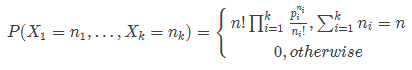

# 机器学习入门

# 斯坦福CS229课程笔记第一章（二）

### 第二部分 分类和逻辑回归（Classification and logistic regression）

接下来讲一下分类的问题。分类问题其实和回归问题很像，只不过我们现在要来预测的 $y$ 的值只局限于若干个离散值。首先关注的是最简单的**二元分类** 问题，也就是说咱们 $y$ 只有两个取值，$0$ 或者 $1$。（这里谈到的大部分内容也都可以扩展到多种类的情况。）例如，假如要建立一个垃圾邮件筛选器，那么就可以用 $x^{(i)}$ 表示一个邮件中的若干特征，然后如果这个邮件是垃圾邮件，$y$ 就设为$1$，否则 $y$ 为 $0$。$0$ 也可以被称为**消极类别（negative class）**，而 $1$ 就成为**积极类别（positive class**），有的情况下也分别表示成“-” 和 “+”。对于给定的一个 $x^{(i)}$，对应的$y^{(i)}$也称为训练样本的**标签（label）**。

在解决分类问题是，之前的线性回归往往很难得到理想的效果，此时就需要我们使用一些更为复杂的算法。

#### 5 逻辑回归（Logistic regression）

逻辑回归可能是分类问题中最为常见的一个算法，它和logistic函数紧密相关。

我们当然也可以还按照之前的线性回归的算法来根据给定的 $x$ 来预测 $y$，只要忽略掉 $y$ 是一个散列值就可以了。然而，这样构建的例子很容易遇到性能问题，这个方法运行效率会非常低，效果很差。而且从直观上来看，$h_\theta(x)$ 的值如果大于$1$ 或者小于$0$ 都是没有意义的，因为在定义使已指定了 $y \in \{0, 1\}$，就是说 $y$ 必然应当是 $0$ 和 $1$ 这两个值当中的一个。

所以我们就改变一下假设函数$h_\theta (x)$ 的形式来解决这个问题。在逻辑回归中选择如下的函数：

$$
h_\theta(x) = g(\theta^T x) = \frac  1{1+e^{-\theta^Tx}}
$$

其中有：

$$
g(z)= \frac 1 {1+e^{-z}}
$$

这个函数叫做**逻辑函数 （Logistic function）** ，或者也叫**双弯曲S型函数（sigmoid function**）。下图是 $g(z)$ 的函数图像：

当$z\to +\infty$  的时候 $g(z)$ 趋向于$1$，而当$z\to -\infty$ 时$g(z)$ 趋向于$0$。此外，这里的这个 $g(z)$ ，也就是 $h(x)$，是一直在 $0$ 和 $1$ 之间波动的。我们依然像之前那样设置 $x_0 = 1$，这样就可以使用向量相乘进行表示：$\theta^T x =\theta_0 +\sum^n_{j=1}\theta_jx_j$·

我们把 $g$ 作为选定的函数。当然其他的从$0$到$1$之间光滑递增的函数也可以使用，后面我们会了解到选择 $g$ 的一些原因（涉及广义线性模型 GLMs，那时候还会讲生成学习算法，generative learning algorithms），对这个逻辑函数的选择是很自然的。在继续深入之前，要讲解的关于这个 S 型函数的导数$g'$ 的一些性质：

$$
\begin{aligned}
g'(z) & = \frac d{dz}\frac 1{1+e^{-z}}\\
& = \frac  1{(1+e^{-z})^2}(e^{-z})\\
& = \frac  1{(1+e^{-z})} \cdot (1- \frac 1{(1+e^{-z})})\\
& = g(z)(1-g(z))\\
\end{aligned}
$$

那么给定了逻辑回归模型后，如何去拟合一个合适的 $\theta$ 呢？我们之前已经看到了在一系列假设的前提下，最小二乘法回归可以通过最大似然估计来推出，那么接下来就给我们的这个分类模型做一系列的统计学假设，然后用最大似然法来拟合参数。

首先假设：

$$
\begin{aligned}
P(y=1|x;\theta)&=h_{\theta}(x)\\
P(y=0|x;\theta)&=1- h_{\theta}(x)\\
\end{aligned}
$$

更简洁的写法是：

$$
p(y|x;\theta)=(h_\theta (x))^y(1- h_\theta (x))^{1-y}
$$

假设 $m$ 个训练样本都是独立的，那么就可以按如下的方式来写参数的似然函数：

$$
\begin{aligned}
L(\theta) &= p(\vec{y}| X; \theta)\\
&= \prod^m_{i=1}  p(y^{(i)}| x^{(i)}; \theta)\\
&= \prod^m_{i=1} (h_\theta (x^{(i)}))^{y^{(i)}}(1-h_\theta (x^{(i)}))^{1-y^{(i)}} \\
\end{aligned}
$$

随后采用和之前相似的方法，对$L(\theta)$取对数，方便取得最大值：

$$
\begin{aligned}
l(\theta) &=\log L(\theta) \\
&= \sum^m_{i=1} (y^{(i)} \log (x^{(i)})+(1-y^{(i)})\log (1-h(x^{(i)})))
\end{aligned}
$$

如何让似然函数取得最大值？就跟之前我们在线性回归的时候用了求导数的方法类似，这次用的是**梯度上升法（gradient ascent）**。还是写成向量的形式，然后进行更新，也就是$ \theta := \theta +\alpha \nabla _\theta l(\theta)$ 。 `(注意更新方程中用的是加号而不是减号，因为我们现在是在找一个函数的最大值，而不是找最小值了，梯度下降和梯度上升的本质是一样的。)` 还是先从只有一组训练样本$(x,y)$ 来开始，然后求导数来推出随机梯度上升规则：

$$
\begin{aligned}
\frac  {\partial}{\partial \theta_j} l(\theta) &=(y\frac  1 {g(\theta ^T x)}  - (1-y)\frac  1 {1- g(\theta ^T x)}   )\frac  {\partial}{\partial \theta_j}g(\theta ^Tx) \\
&= (y\frac  1 {g(\theta ^T x)}  - (1-y)\frac  1 {1- g(\theta ^T x)}   )  g(\theta^Tx)(1-g(\theta^Tx)) \frac  {\partial}{\partial \theta_j}\theta ^Tx \\
&= (y(1-g(\theta^Tx) ) -(1-y) g(\theta^Tx)) x_j\\
&= (y-h_\theta(x))x_j
\end{aligned}
$$

上面的式子里，我们用到了对函数求导的定理 $ g'(z)= g(z)(1-g(z))$  。然后就得到了随机梯度上升规则：

$$
\theta_j := \theta_j + \alpha (y^{(i)}-h_\theta (x^{(i)}))x_j^{(i)}
$$

和之前的 LMS 更新规则相对比，发现看上去挺相似的，但它们并不是同一个算法，因为这里的$h_\theta(x^{(i)})$现在定义成了一个 $\theta^Tx^{(i)}$  的非线性函数。尽管如此，我们面对不同的学习问题使用了不同的算法，却得到了看上去一样的更新规则，这个还是有点让人吃惊。这是一个巧合么，还是背后有更深层次的原因呢？在我们学到了 GLM 广义线性模型的时候就会得到答案了。需要注意的是，上面的这些算法都不局部优化，而是全局优化。

#### 6 感知器学习算法（The perceptron learning algorithm）

现在简要地聊另外一个算法，之后我们讲学习理论的时候还要讲到它。设想一下，对逻辑回归方法修改一下，“强迫”它输出的值要么是 $0$ 要么是 $1$。要实现这个目的，很自然就应该把函数 $g$ 的定义修改一下，改成一个**阈值函数（threshold function）**：

$$
g(z)= \begin{cases} 1 &  if\quad z \geq 0  \\
0 &  if\quad z < 0  \end{cases}
$$

如果我们还像之前一样令 $h_\theta(x) = g(\theta^T x)$，但用刚刚上面的阈值函数作为 $g$ 的定义，然后如果我们用了下面的更新规则：

$$
\theta_j := \theta_j +\alpha(y^{(i)}-h_\theta (x^{(i)}))x_j^{(i)}
$$

这样我们就得到了**感知机学习算法。**

感知机是一个二分类的线性分类模型，它要在二维（或高维）空间找到一个超平面，将所有二元类别分开。感知机一般只处理线性可分的样本。

在 1960 年代，这个“感知机”被认为是对大脑中单个神经元工作方法的一个粗略建模。鉴于这个算法的简单程度，这个算法也是我们后续在本课程中讲学习理论的时候的起点。但一定要注意，虽然这个感知器学习算法可能看上去表面上跟我们之前讲的其他算法挺相似，但实际上这是一个和逻辑回归以及最小二乘线性回归等算法在种类上都完全不同的算法；尤其重要的是，很难对感知器的预测赋予有意义的概率解释，也很难作为一种最大似然估计算法来推出感知器学习算法。感知机是有限的，它永远无法解决异或问题。

#### 7 牛顿法

牛顿法常常用于求实根和最优化算法，它是让 $l(\theta)$ 取最大值的另一个算法。

开始之前，咱们先想一下求一个方程零点的牛顿法。将$f(x)$在$x_0$处一阶泰勒展开：$f(x)=f(x_0)+f'(x_0)(x-x_0)$，求解方程$f(x)=0$即求解$f(x_0)+f'(x_0)(x-x_0)=0$

可以解得$x=x_1=x_0-\frac{f(x_0)}{f'(x_0)}$，但由于$f(x)$的等式是泰勒展开的近似结果，所以此处求得的$x_1$并不能让$f(x)=0$，只能说$f(x_1)$比$f(x_0)$更接近0，我们就可以采取迭代求解的思路，最终找到最终的近似的根。

假如我们有一个从实数到实数的函数 $f:R \to R$，然后要找到一个 $\theta$ ，来满足 $f(\theta)=0$，其中 $\theta\in R$ 是一个实数。牛顿法就是对 $\theta$ 进行如下的更新：
$$
\theta := \theta - \frac {f(\theta)}{f'(\theta)}
$$

这个方法可以通过一个很自然的解释，我们可以把它理解成用一个线性函数来对函数 $f$ 进行逼近，这条直线是 $f$ 的切线，而猜测值是 $\theta$，解的方法就是找到线性方程等于零的点，把这一个零点作为 $\theta$ 设置给下一次猜测，然后以此类推。

下面是对牛顿法的图解：

在最左边的图里面，可以看到函数 $f$ 就是沿着 $y=0$ 的一条直线。这时候是想要找一个 $\theta$ 来让 $f(\theta)=0$。这时候发现这个 $\theta$ 值大概在 $1.3$ 左右。加入咱们猜测的初始值设定为 $\theta=4.5$。牛顿法就是在 $\theta=4.5$ 这个位置画一条切线（中间的图）。这样就给出了下一个 $\theta$ 猜测值的位置，也就是这个切线的零点，大概是$2.8$。最右面的图中的是再运行一次这个迭代产生的结果，这时候 $\theta$ 大概是$1.8$。就这样几次迭代之后，很快就能接近 $\theta=1.3$。

牛顿法的给出的解决思路是让 $f(\theta) = 0$ 。如果咱们要用它来让函数 $l$ 取得最大值能不能行呢？函数 $l$ 的最大值的点应该对应着是它的导数$l'(\theta)$ 等于零的点。所以通过令$f(\theta) = l'(\theta)$，咱们就可以同样用牛顿法来找到 $l$ 的最大值，然后得到下面的更新规则：

$$
\theta := \theta - \frac {l'(\theta)}{l''(\theta)}
$$

（扩展一下，额外再思考一下: 如果咱们要用牛顿法来求一个函数的最小值而不是最大值，该怎么修改？）`试试法线的零点`

最后，在逻辑回归的背景中，$\theta$ 是一个有值的向量，所以我们要对牛顿法进行扩展来适应这个情况。牛顿法进行扩展到多维情况，也叫牛顿-拉普森法（Newton-Raphson method），如下所示：

$$
\theta := \theta - H^{-1}\nabla_\theta l(\theta)
$$

上面这个式子中的 $\nabla_\theta l(\theta)$和之前的样例中的类似，是关于 $\theta_i$ 的 $l(\theta)$ 的偏导数向量；而 $h$ 是一个 $n\times n$ 矩阵 ,实际上如果包含截距项的话，应该是, $(n + 1)\times (n + 1)$，也叫做 Hessian, 其详细定义是：

$$
H_{ij}= \frac {\partial^2 l(\theta)}{\partial \theta_i \partial \theta_j}
$$

牛顿法通常都能比（批量）梯度下降法收敛得更快，而且达到最小值所需要的迭代次数也低很多。然而，牛顿法中的单次迭代往往要比梯度下降法的单步耗费更多的性能开销，因为要查找和转换一个  $n\times n$的 Hessian 矩阵；不过只要这个 $n$ 不是太大，牛顿法通常就还是更快一些。当用牛顿法来在逻辑回归中求似然函数$l(\theta)$ 的最大值的时候，得到这一结果的方法也叫做**Fisher评分（Fisher scoring）。**（牛顿法和Hessian矩阵会在专栏做更详细的介绍）

### 第三部分 广义线性模型 (Generalized Linear Models)$^5$

>5 本节展示的内容受以下两份作品的启发：Michael I. Jordan, Learning in graphical models (unpublished book draft), 以及 McCullagh and Nelder, Generalized Linear Models (2nd ed.)。

到目前为止，我们已经分析了回归案例和分类案例。在回归的案例中，我们得到的函数是 $y|x; \theta ∼ N (\mu, \sigma^2)$；而分类的案例中，函数是 $y|x; \theta ∼ Bernoulli(\phi)$，这里面的$\mu$ 和 $\phi$ 分别是 $x$ 和 $\theta$ 的某种函数。在本节，我们会发现这两种方法都是一个更广泛使用的模型的特例，这种更广泛使用的模型就叫做广义线性模型。我们还会讲一下广义线性模型中的其他模型是如何推出的，以及如何应用到其他的分类和回归问题上。

#### 8 指数族 (The exponential family)

在学习 GLMs 之前，我们要先定义一下指数组分布（exponential family distributions）。如果一个分布能用下面的方式来写出来，我们就说这类分布属于指数族：

$$
p(y;\eta) =b(y)exp(\eta^TT(y)-a(\eta)) \qquad \text{(6)}
$$

上面的式子中，$\eta$ 叫做此分布的**自然参数** （natural parameter，也叫**典范参数 canonical parameter**） ； $T(y)$ 叫做**充分统计量（sufficient statistic）** ，我们目前用的这些分布中通常 $T (y) = y$；而 $a(\eta)$ 是一个**对数分割函数（log partition function）。** $e^{−a(\eta)}$ 这个量本质上扮演了归一化常数（normalization constant）的角色，也就是确保 $p(y; \eta)$ 的总和或者积分等于$1$。

当给定 $T$, $a$ 和 $b$ 时，就定义了一个用 $\eta$ 进行参数化的分布族（family，或者叫集 set）；通过改变 $\eta$，我们就能得到这个分布族中的不同分布。

现在咱们看到的伯努利（Bernoulli）分布和高斯（Gaussian）分布就都属于指数分布族。伯努利分布的均值是$\phi$，也写作 $Bernoulli(\phi)$，确定的分布是 $y \in \{0, 1\}$，因此有 $p(y = 1; \phi) = \phi$; $p(y = 0;\phi) = 1−\phi$。这时候只要修改$\phi$，就能得到一系列不同均值的伯努利分布了。通过修改$\phi$,而得到的这种伯努利分布，就属于指数分布族；也就是说，只要给定一组 $T$，$a$ 和 $b$，就可以用上面的等式$(6)$来确定一组特定的伯努利分布了。

我们这样来写伯努利分布：

$$
\begin{aligned}
p(y;\phi) & = \phi ^y(1-\phi)^{1-y}\\
& = exp(y \log \phi + (1-y)\log(1-\phi))\\
& = exp( (log (\frac {\phi}{1-\phi}))y+\log (1-\phi) )\\
\end{aligned}
$$

因此，自然参数（natural parameter）就给出了，即 $\eta = log (\frac   \phi {1 − \phi})$。 很有趣的是，如果我们翻转这个定义，用$\eta$ 来解 $\phi$ 就会得到 $\phi = 1/ (1 + e^{−\eta} )$。这正好就是之前我们刚刚见到过的 S型函数(sigmoid function)！在我们把逻辑回归作为一种广义线性模型（GLM）的时候还会得到：

$$
\begin{aligned}
T(y) &= y \\
a( \eta) & = - \log (1- \phi) \\
& = \log {(1+ e^ \eta)}\\
b(y)&=1
\end{aligned}
$$

上面这组式子就表明了伯努利分布可以写成等式$(6)$的形式，使用一组合适的$T$, $a$ 和 $b$。

接下来就看看高斯分布吧。在推导线性回归的时候，$\sigma^2$ 的值对我们最终选择的 $\theta$ 和 $h_\theta(x)$ 都没有影响。所以我们可以给 $\sigma^2$ 取个任意值。为了简化推导过程，就令$\sigma^2 = 1$。$^6$然后就有了下面的等式：

$$
\begin{aligned}
p(y;\mu) &= \frac 1{\sqrt{2\pi}} exp (- \frac  12 (y-\mu)^2) \\
& =  \frac 1{\sqrt{2\pi}} exp (- \frac  12 y^2) \cdot exp (\mu y -\frac  12 \mu^2) \\
\end{aligned}
$$

>6 如果我们把 $\sigma^2$ 留作一个变量，高斯分布就也可以表达成指数分布的形式，其中 $\eta \in R^2$ 就是一个二维向量，同时依赖 $\mu$ 和 $\sigma$。然而，对于广义线性模型GLMs方面的用途， $\sigma^2$ 参数也可以看成是对指数分布族的更泛化的定义： $p(y; \eta, \tau ) = b(a, \tau ) exp((\eta^T T (y) − a(\eta))/c(\tau))$。这里面的$\tau$ 叫做**分散度参数（dispersion parameter）**，对于高斯分布， $c(\tau) = \sigma^2$ ；不过上文中我们已经进行了简化，所以针对我们要考虑的各种案例，就不需要再进行更加泛化的定义了。

这样，我们就可以看出来高斯分布是属于指数分布族的，可以写成下面这样：

$$
\begin{aligned}
\eta & = \mu \\
T(y) & = y \\
a(\eta) & = \mu ^2 /2\\
& = \eta ^2 /2\\
b(y) & = (1/ \sqrt {2\pi })exp(-y^2/2)
\end{aligned}
$$

指数分布族里面还有很多其他的分布：

- 例如多项式分布（multinomial），这个后面我们会看到；

  

- 泊松分布（Poisson），用于对计数类数据进行建模，后面在问题集里面也会看到；

  $P(x=k)=\frac{\lambda ^k}{k!}e^{-\lambda}(k=1,2,3……)$

- 伽马和指数分布（the gamma and the exponential），这个用于对连续的、非负的随机变量进行建模，例如时间间隔；

- 贝塔和狄利克雷分布（the beta and the Dirichlet），这个是用于概率的分布；

  

在下一节我们就来讲一讲对于建模的一个更通用的“方案”，其中的$y$ （给定 $x$ 和 $\theta$）可以是上面这些分布中的任意一种。

#### 9 构建广义线性模型（Constructing GLMs）

设想你要构建一个模型来估计在给定时间段内光顾你开的商店的顾客人数（或者是你的知乎主页的被访问次数），选择的特征 $x$ 可以是商店的促销力度、最近的广告推送、天气等等。泊松分布（Poisson distribution）通常适合用来对访客数目进行建模。知道了这一点之后，怎么来建立一个模型来解决咱们这个具体问题呢？非常幸运的是，泊松分布是属于指数分布族的一个分布，我们可以对该问题建立广义线性模型（Generalized Linear Model，缩写为 GLM）。在本节中，我们会讲一种针对刚刚这类问题构建广义线性模型的方法。

进一步泛化，设想一个分类或者回归问题，要预测一些随机变量 $y$ 的值，作为 $x$ 的一个函数。要导出适用于这个问题的广义线性模型，就要对我们的模型、给定 $x$ 下 $y$ 的条件分布来做出以下三个假设：

1.	$y | x; \theta ∼ Exponential Family(\eta)$，即给定 $x$ 和 $\theta, y$ 的分布属于指数分布族，是一个参数为 $\eta$ 的指数分布。——假设1
2.	给定 $x$，目的是要预测对应这个给定 $x$ 的 $T(y)$ 的期望值。咱们的例子中绝大部分情况都是 $T(y) = y$，这也就意味着我们的学习假设 $h$ 输出的预测值 $h(x)$ 要满足 $h(x) = E[y|x]$。 （注意，这个假设通过对 $h_\theta(x)$ 的选择而满足，在逻辑回归和线性回归中都是如此。例如在逻辑回归中， $h_\theta (x) = [p (y = 1|x; \theta)] =[ 0 \cdot p (y = 0|x; \theta)+1\cdot p(y = 1|x;\theta)] = E[y|x;\theta]$。**译者注：这里的$E[y|x$]应该就是对给定$x$时的$y$值的期望的意思。**）——假设2
3.	自然参数 $\eta$ 和输入值 $x$ 是线性相关的，$\eta = \theta^T x$，或者如果 $\eta$ 是有值的向量，则有$\eta_i = \theta_i^T x$。——假设3

上面的几个假设中，第三个可能看上去证明得最差，所以也更适合把这第三个假设看作是一个我们在设计广义线性模型时候的一种 **“设计选择 design choice”**，而不是一个假设。那么这三个假设/设计，就可以用来推导出一个非常合适的学习算法类别，也就是广义线性模型 GLMs，这个模型有很多特别友好又理想的性质，比如很容易学习。此外，这类模型对一些关于 $y$ 的分布的不同类型建模来说通常效率都很高；例如，我们下面就将要简单介绍一些逻辑回归以及普通最小二乘法这两者如何作为广义线性模型来推出。

##### 9.1 普通最小二乘法（Ordinary Least Squares）

我们这一节要讲的是普通最小二乘法实际上是广义线性模型中的一种特例，设想如下的背景设置：目标变量 $y$（在广义线性模型的术语也叫做**响应变量response variable**）是连续的，然后我们将给定 $x$ 的 $y$ 的分布以高斯分布 $N(\mu, \sigma^2)$ 来建模，其中 $\mu$ 可以是依赖 $x$ 的一个函数。这样，我们就让上面的$ExponentialFamily(\eta)$分布成为了一个高斯分布。在前面内容中我们提到过，在把高斯分布写成指数分布族的分布的时候，有$\mu = \eta$。所以就能得到下面的等式：

$$
\begin{aligned}
h_\theta(x)& = E[y|x;\theta] \\
& = \mu \\
& = \eta \\
& = \theta^Tx\\
\end{aligned}
$$

第一行的等式是基于假设2；第二个等式是基于定理当 $y|x; \theta ∼ N (\mu, \sigma ^2)$，则 $y$ 的期望就是 $\mu$ ；第三个等式是基于假设1，以及之前我们此前将高斯分布写成指数族分布的时候推导出来的性质 $\mu = \eta$；最后一个等式就是基于假设3。

##### 9.2 逻辑回归（Logistic Regression）

接下来咱们再来看看逻辑回归。这里还是以二值化分类问题为例，也就是 $y \in \{0, 1\}$。给定了$y$ 是一个二选一的值，那么很自然就选择伯努利分布（Bernoulli distribution）来对给定 $x$ 的 $y$ 的分布进行建模了。在我们把伯努利分布写成一种指数族分布的时候，有 $\phi = 1/ (1 + e^{−\eta})$。另外还要注意的是，如果有 $y|x; \theta ∼ Bernoulli(\phi)$，那么 $E [y|x; \theta] = \phi$。所以就跟刚刚推导普通最小二乘法的过程类似，有以下等式：

$$
\begin{aligned}
h_\theta(x)& = E[y|x;\theta] \\
& = \phi \\
& = 1/(1+ e^{-\eta}) \\
& = 1/(1+ e^{-\theta^Tx})\\
\end{aligned}
$$

所以，上面的等式就给了给了假设函数的形式：$h_\theta(x) = 1/ (1 + e^{−\theta^T x})$。如果你之前好奇咱们是怎么想出来逻辑回归的函数为$1/ (1 + e^{−z} )$，这个就是一种解答：一旦我们假设以 $x$ 为条件的 $y$ 的分布是伯努利分布，那么根据广义线性模型和指数分布族的定义，就会得出这个式子。

再解释一点术语，这里给出分布均值的函数 $g$ 是一个关于自然参数的函数，$g(\eta) = E[T(y); \eta]$，这个函数也叫做**规范响应函数（canonical response function），** 它的反函数 $g^{−1}$ 叫做**规范链接函数（canonical link function）。** 因此，对于高斯分布来说，它的规范响应函数正好就是识别函数（identify function）；而对于伯努利分布来说，它的规范响应函数则是逻辑函数（logistic function）。$^7$

>7 很多教科书用 $g$ 表示链接函数，而用反函数$g^{−1}$ 来表示响应函数；但是咱们这里用的是反过来的，这是继承了早期的机器学习中的用法，我们这样使用和后续的其他课程能够更好地衔接起来。

##### 9.3 Softmax 回归

咱们再来看一个广义线性模型的例子吧。设想有这样的一个分类问题，其中响应变量 $y$ 的取值可以是 $k$ 个值当中的任意一个，也就是 $y \in \{1, 2, ..., k\}$。例如，我们这次要进行的分类就比把邮件分成垃圾邮件和正常邮件两类这种二值化分类要更加复杂一些，比如可能是要分成三类，例如垃圾邮件、个人邮件、工作相关邮件。这样响应变量依然还是离散的，但取值就不只有两个了。这时可以选用多项式分布（multinomial distribution）来进行建模。

下面咱们就通过这种多项式分布来推出一个广义线性模型。要实现这一目的，首先还是要把多项式分布也用指数族分布来进行描述。

要对一个可能有 $k$ 个不同输出值的多项式进行参数化，就可以用 $k$ 个参数 $\phi_1,...,\phi_ k$ 来对应各自输出值的概率。不过这样参数可能过多，形式上也太麻烦，他们未必都是互相独立的（比如对于任意一个$\phi_ i$中的值来说，只要知道其他的 $k-1$ 个值，就能知道这最后一个了，因为总和等于$1$，也就是$\sum^k_{i=1} \phi_i = 1$）。所以咱们就去掉一个参数，只用 $k-1$ 个：$\phi_1,...,\phi_ {k-1}$  来对多项式进行参数化，其中$\phi_i = p (y = i; \phi)，p (y = k; \phi) = 1 −\sum ^{k−1}_{i=1}\phi_ i$。为了表述起来方便，我们还要设 $\phi_k = 1 − \sum_{i=1}^{k−1} \phi_i$，但一定要注意，这个并不是一个参数，而是完全由其他的 $k-1$ 个参数来确定的一个值。

要把一个多项式表达成为指数组分布，还要按照下面的方式定义一个 $T (y) \in R^{k−1}$:

$$
T(1)=
    \begin{bmatrix}
      1\\
      0\\
	  0\\
	  \vdots \\
	  0\\
    \end{bmatrix},
T(2)=
    \begin{bmatrix}
      0\\
      1\\
	  0\\
	  \vdots \\
	  0\\
    \end{bmatrix},
T(3)=
    \begin{bmatrix}
      0\\
      0\\
	  1\\
	  \vdots \\
	  0\\
    \end{bmatrix},
T(k-1)=
    \begin{bmatrix}
      0\\
      0\\
	  0\\
	  \vdots \\
	  1\\
    \end{bmatrix},
T(k)=
    \begin{bmatrix}
      0\\
      0\\
	  0\\
	  \vdots \\
	  0\\
    \end{bmatrix},
$$

这次和之前的样例都不一样了，就是不再有 $T(y) = y$；然后，$T(y)$ 现在是一个 $k – 1$ 维的向量，而不是一个实数了。向量 $T(y)$ 中的第 $i$ 个元素写成$(T(y))_i$ 。

现在介绍一种非常有用的记号。指示函数（indicator function）$1\{\cdot  \}$，如果参数为真，则等于$1$；反之则等于$0$（$1\{True\} = 1, 1\{False\} = 0$）。例如$1\{2 = 3\} = 0$, 而$1\{3 = 5 − 2\} = 1$。所以我们可以把$T(y)$ 和 $y$ 的关系写成  $(T(y))_i = 1\{y = i\}$。（往下继续阅读之前，一定要确保你理解了这里的表达式为真！）在此基础上，就有了$E[(T(y))_i] = P (y = i) = \phi_i$。

现在一切就绪，可以把多项式写成指数族分布了。写出来如下所示：

$$
\begin{aligned}
p(y;\phi) &=\phi_1^{1\{y=1\}}\phi_2^{1\{y=2\}}\dots \phi_k^{1\{y=k\}} \\
          &=\phi_1^{1\{y=1\}}\phi_2^{1\{y=2\}}\dots \phi_k^{1-\sum_{i=1}^{k-1}1\{y=i\}} \\
          &=\phi_1^{(T(y))_1}\phi_2^{(T(y))_2}\dots \phi_k^{1-\sum_{i=1}^{k-1}(T(y))_i } \\
          &=exp((T(y))_1 log(\phi_1)+(T(y))_2 log(\phi_2)+\dots+(1-\sum_{i=1}^{k-1}(T(y))_i)log(\phi_k)) \\
          &= exp((T(y))_1 log(\frac{\phi_1}{\phi_k})+(T(y))_2 log(\frac{\phi_2}{\phi_k})+\dots+(T(y))_{k-1}log(\frac{\phi_{k-1}}{\phi_k})+log(\phi_k)) \\
          &=b(y)exp(\eta^T T(y)-a(\eta))
\end{aligned}
$$

其中：

$$
\begin{aligned}
\eta &= 
    \begin{bmatrix}
      \log (\phi _1/\phi _k)\\
      \log (\phi _2/\phi _k)\\
	  \vdots \\
	  \log (\phi _{k-1}/\phi _k)\\
    \end{bmatrix}, \\
a(\eta) &= -\log (\phi _k)\\
b(y) &= 1\\
\end{aligned}
$$

这样咱们就把多项式方程作为一个指数族分布来写了出来。

与 $i (for\quad i = 1, ..., k)$对应的链接函数为：

$$
\eta_i =\log \frac  {\phi_i}{\phi_k}
$$

为了方便起见，我们再定义 $\eta_k = \log (\phi_k/\phi_k) = 0$。对链接函数取反函数然后推导出响应函数，就得到了下面的等式：

$$
\begin{aligned}
e^{\eta_i} &= \frac {\phi_i}{\phi_k}\\
\phi_k e^{\eta_i} &= \phi_i  \qquad\text{(7)}\\
\phi_k  \sum^k_{i=1} e^{\eta_i}&= \sum^k_{i=1}\phi_i= 1\\
\end{aligned}
$$

这就说明了$\phi_k = \frac  1 {\sum^k_{i=1} e^{\eta_i}}$，然后可以把这个关系代入回到等式$(7)$，这样就得到了响应函数：

$$
\phi_i = \frac  { e^{\eta_i} }{ \sum^k_{j=1} e^{\eta_j}}
$$

上面这个函数从$\eta$ 映射到了$\phi$，称为 **Softmax** 函数。

要完成我们的建模，还要用到前文提到的假设3，也就是 $\eta_i$ 是一个 $x$ 的线性函数。所以就有了 $\eta_i= \theta_i^Tx (for\quad i = 1, ..., k − 1)$，其中的 $\theta_1, ..., \theta_{k−1} \in R^{n+1}$ 就是我们建模的参数。为了表述方便，我们这里还是定义$\theta_k = 0$，这样就有 $\eta_k = \theta_k^T x = 0$，跟前文提到的相符。因此，我们的模型假设了给定 $x$ 的 $y$ 的条件分布为：

$$
\begin{aligned}
p(y=i|x;\theta) &=  \phi_i \\
&= \frac {e^{\eta_i}}{\sum^k_{j=1}e^{\eta_j}}\\
&=\frac {e^{\theta_i^Tx}}{\sum^k_{j=1}e^{\theta_j^Tx}}\qquad\text{(8)}\\
\end{aligned}
$$

这个适用于解决 $y \in\{1, ..., k\}$ 的分类问题的模型，就叫做 **Softmax 回归。** 这种回归是对逻辑回归的一种扩展泛化。

假设（hypothesis） $h$ 则如下所示:

$$
\begin{aligned}
h_\theta (x) &= E[T(y)|x;\theta]\\
&= E \left[
    \begin{array}{cc|c}
      1(y=1)\\
      1(y=2)\\
	  \vdots \\
	  1(y=k-1)\\
    \end{array}x;\theta
\right]\\
&= E \left[
    \begin{array}{c}
      \phi_1\\
      \phi_2\\
	  \vdots \\
	  \phi_{k-1}\\
    \end{array}
\right]\\
&= E \left[
    \begin{array}{ccc}
      \frac {exp(\theta_1^Tx)}{\sum^k_{j=1}exp(\theta_j^Tx)} \\
      \frac {exp(\theta_2^Tx)}{\sum^k_{j=1}exp(\theta_j^Tx)} \\
	  \vdots \\
	  \frac {exp(\theta_{k-1}^Tx)}{\sum^k_{j=1}exp(\theta_j^Tx)} \\
    \end{array}
\right]\\
\end{aligned}
$$

也就是说，我们的假设函数会对每一个 $i = 1,...,k$ ，给出 $p (y = i|x; \theta)$ 概率的估计值。（虽然在前面假设的这个 $h_\theta(x)$ 只有 $k-1$ 维，但很明显 $p (y = k|x; \theta)$ 可以通过用 $1$ 减去其他所有项目概率的和来得到，即$1− \sum^{k-1}_{i=1}\phi_i$。）

最后，我们再来谈一下参数拟合。和我们之前对普通最小二乘线性回归和逻辑回归的原始推导类似，如果咱们有一个有 $m$ 个训练样本的训练集 $\{(x^{(i)}, y^{(i)}); i = 1, ..., m\}$，然后要研究这个模型的参数 $\theta_i$ ，我们可以先写出其似然函数的对数：

$$
\begin{aligned}
l(\theta)& =\sum^m_{i=1} \log p(y^{(i)}|x^{(i)};\theta)\\
&= \sum^m_{i=1}log\prod ^k_{l=1}(\frac {e^{\theta_l^Tx^{(i)}}}{\sum^k_{j=1} e^{\theta_j^T x^{(i)}}})^{1(y^{(i)}=l)}\\
\end{aligned}
$$

要得到上面等式的第二行，要用到等式$(8)$中的设定 $p(y|x; \theta)$。现在就可以通过对 $l(\theta)$ 取最大值得到的 $\theta$ 而得到对参数的最大似然估计，使用的方法就可以用梯度上升法或者牛顿法了。

## 参考链接

本笔记大量参考大佬在github上已经做好的学习笔记，感谢大佬的分享，特此声明。

**原作者**：[Andrew Ng  吴恩达](http://www.andrewng.org/)

**讲义翻译者**：[CycleUser](https://www.zhihu.com/people/cycleuser/columns)

**Github参考链接：**[Github 地址](https://github.com/Kivy-CN/Stanford-CS-229-CN)

[斯坦福大学 CS229 课程网站](http://cs229.stanford.edu/)

[知乎专栏](https://zhuanlan.zhihu.com/MachineLearn)

