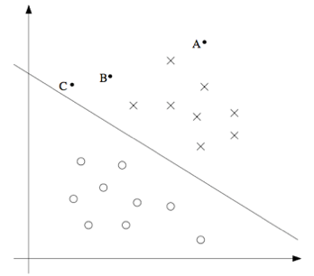

# CS229 课程讲义中文翻译

# 斯坦福CS229课程笔记第三章

### 第五部分 支持向量机(Support Vector Machines)

本章的讲义主要讲述的是 支持向量机（Support Vector Machine ） 学习算法。SVM 算得上是现有的最好的现成的监督学习算法之一，在介绍SVM算法之前，我们有必要了解一些关于边界的内容，以及对数据进行分割成大的区块（gap）的思路。随后，我们要讲一下最优边界分类器(optimal margin classifier,)，其中还会引入一些关于拉格朗日对偶(Lagrange duality)的内容。然后我们还会接触到核(Kernels)，这提供了一种在非常高的维度(例如无穷维度)中进行 SVM 学习的高效率方法，最终本章结尾部分会讲 SMO 算法，也就是 SVM 算法的一个有效实现方法。

#### 1 边界(Margins)：直觉(Intuition) 

我们从边界(margins)开始说起。这一节我们会给出关于边界的一些直观展示(intuitions)，以及对于我们做出的预测的信心(confidence)；在本章的第三节中，会对这些概念进行更正式的表述。

在逻辑回归中，概率分布$p(y = 1|x;\theta)$ 是基于 $h_\theta(x) = g(\theta^Tx)$ 而建立的模型。当且仅当 $h_\theta(x) \geq 0.5$ ，也就是 $\theta^Tx \geq 0$ 的时候，我们才会预测出“$1$”。假如有一个正向的训练样本(positive tra_ining example)($y = 1$)。那么$\theta^Tx$ 越大，$h_\theta (x) = p(y = 1|x; w, b)$ 也就越大，我们对预测的 Label 为 $1$ 的“信心(confidence)”也就越强。如果 $y = 1$ 且 $\theta^T x \gg 0$（远大于 $0$），那么我们就对这时候进行的预测非常有信心，当然这只是一种很不正式的粗略认识，它只能大概的描述我们做出预测的把握有多大，但它并不能完全真实的描述概率。同理，在逻辑回归中，如果有 $y = 0$ 且 $\theta^T x \ll 0$(远小于 0)，我们也对这时候给出的预测很有信心。所以对于一个给定的训练集，如果我们能找到一个 $\theta$，满足当 $y^{(i)} = 1$ 的时候总有 $\theta^T x^{(i)} \gg 0$，而 $y^{(i)} = 0$ 的时候则 $\theta^T x^{(i)} \ll 0$，我们就说这个对训练数据的拟合很好，因为这就能对所有训练样本给出可靠（甚至正确）的分类。得到这样的一个模型就是我们的一个训练目标，稍后我们就要使用**函数边界记号(notion of functional margins)** 来用更加规范的语言来描述该思路。

还有另外一种直观的表示，在下面这个图中，画叉的点表示的是正向训练样本，而小圆圈的点表示的是负向训练样本，图中还画出了**分类边界(decision boundary)，** 这条线也就是通过等式 $\theta^T x = 0$ 来确定的，也叫做**分类超平面(separating hyperplane)。** 图中还标出了三个点 $A，B 和 C$。

可以发现 $A$ 点距离分界线很远。如果我们对 $A$ 点的 $y$ 值进行预测，估计我们很有信心地认为在那个位置的 $y = 1$，这样的点很好用模型作出预测。与之相反的是 $C$，这个点距离边界线很近，虽然 $C$ 点也在$y = 1$ 的一侧，但其预测值$y_c=1$未必符合实际的情况，很可能会让我们对这个点的预测为 $y = 0$。因此，我们对 $A$ 点的预测要比对 $C$ 点的预测更有把握得多。$B$ 点正好在上面两种极端情况之间，更广泛地说，如果一个点距离**分类超平面(separating hyperplane)** 比较远，我们就可以对给出的预测更有信心。那么给定一个训练集，如果我们能够找到一个分类边界，利用这个边界我们可以对所有的训练样本给出正确并且有信心（也就是数据点距离分类边界要都很远）的预测，那这就是我们想要达到的状态了。上面这种说法并不正规，后面我们会使用**几何边界记号(notion of geometric margins)** 来更正规地来表达。

#### 2 记号(Notation) 

在讨论 SVMs 的时候，为了简化表达，我们先要引入一个新的记号，用来表示分类。假设我们要针对一个二值化分类的问题建立一个线性分类器，其中用来分类的标签(label)为 $y$，分类特征(feature)为 $x$。我们就用 $y \in \{{-1},1\}$ 来表示这个分类标签（不是之前的{0,1}）。另外我们也不再使用向量 $\theta$ 来表示线性分类器的参数了，而是使用参数 $w$ 和 $b$，将分类器写成下面这样的形式：

$$
h_{w,b}(x)=g(w^Tx+b)
$$

当 $z \geq 0$，则 $g(z) = 1$；而反之若 $z ＜ 0$，则$g(z) = -1$。这里的这个 “$w, b$” 记号可以帮助我们把截距项(intercept term)$b$ 与其他的参数区别开。（我们也不用再像之前那样要去设定 $x_0 = 1$ 这样的一个额外的输入特征向量了。）所以，这里的这个参数 $b$ 扮演的角色就相当于之前的参数 $\theta_0$ ，而参数 $w$ 则相当于 $[\theta_1 \dots \theta_n]^T$。

还要注意的是，从我们上面对函数 $g$ 的定义，可以发现我们的分类器给出的预测是 $1$ 或者 $-1$ （参考 感知器算法 perceptron algorithm），这样也就不需要先通过中间步骤(intermediate step)来估计 $y$ 为 $1$ （这里指逻辑回归中的步骤）的概率，具体细节可以参考前面的文章。

#### 3 函数边界和几何边界(Functional and geometric margins) 

现在我们用正规语言来将函数边界记号和几何边界记号的概念进行正规化。给定一个训练集 $(x^{(i)}, y^{(i)})$，我们用下面的方法来定义对应该训练集的**函数边界** $(w, b)$：

$$
\hat\gamma^{(i)}=y^{(i)}(w^Tx+b)
$$

要注意，如果 $y^{(i)} = 1$，那么为了让函数边界很大（也就是说，我们的预测很可信并且很正确），我们就需要 $w^T x + b$ 是一个很大的正数。与此相对，如果 $y^{(i)} = -1$，那么为了让函数边界很大，我们就需要$w^T x + b$ 是一个（绝对值）很大的负数。而且，只要满足 $y^{(i)}(w^T x + b) \ge 0$，那我们针对这个样本的预测就是正确的。而当$y^{(i)}(w^T x + b) \le 0$时，我们可以判断该样本被误分类了，因此，一个大的函数边界就表示了一个可信且正确的预测。

对于一个线性分类器，选择上面给定的函数 $g$ （取值范围为$\{-1, 1\}$），选择该函数作为分类器是因为其函数边界的一个性质：我们发现这个分类器并不具有对置信度的良好量度。例如上面给定的这个函数 $g$，我们会发现，如果用 $2w$ 替换掉 $w$，然后用 $2b$ 替换 $b$，那么有 $g(w^Tx + b) = g(2w^Tx + 2b)$，作出这样的改变也不会影响 $h_{w,b}(x)$。也就是说，函数 $g$ 和$h_{w,b}(x)$只取决于 $w^T x + b$ 的正负，而不受其大小(magnitude)的影响。但是，把$(w, b)$ 翻倍成 $(2w,2b)$ 还会导致函数距离也被放大了 $2$ 倍。因此我们就可以通过随意去调整 $w$ 和 $b$ 的大小，人为的调整出我们之前假设中理想的函数边界，而不用去改变任何有实际意义的变量。直观地看，这就导致我们有必要引入某种归一化条件，例如使 $\parallel w\parallel_2 = 1$；也就是说，我们可以将 $(w, b)$ 替换成 $(w/\parallel w\parallel _2,b/\parallel w\parallel _2)$，然后考虑对应 $(w/\parallel w\parallel_2,b/\parallel w\parallel_2)$ 的函数边界。我们后面会详细讨论这部分内容。

ps.这里$\parallel w\parallel_2$用到了L2范数的表示

给定一个训练集 $S = \{(x^{(i)},y^{(i)}); i = 1, ..., m\}$，我们将对应 $S$ 的函数边界 $(w, b)$ 定义为每个训练样本的函数边界的最小值。记作 $\hat \gamma$，可以写成：

$$
\hat\gamma= \min_{i=1,...,m}\hat\gamma^{(i)}
$$

接下来，咱们要讲的是**几何边界(geometric margins)。** 例如下图所示：

图中给出了对应 $(w, b)$ 的分类边界，其倾斜方向（即法线方向）为向量 $w$ 的方向。这里的向量 $w$ 是与**分类超平面**垂直的。假设有图中所示的一个点 $A$，此点表示的是针对某训练样本的输入特征为 $x^{(i)}$ ，对应的标签(label)为 $y^{(i)} = 1$。然后这个点到分类边界的距离 $\gamma^{(i)}$， 就通过 $AB$ 之间的线段能够获得。

那么怎么得到 $\gamma^{(i)}$的 值呢？已知$w/\parallel w\parallel $ 是一个与$w$方向相同，大小为单位长度的一个向量。因为这里 $A$ 点表示的是 $x^{(i)}$，过点$A$做超平面垂线，与超平面交于$B$，我们就能找到一个点 $B$，其位置为 $x^{(i)} - \gamma^{(i)} \times w/\parallel w\parallel $。由于 $B$ 点正好位于分类边界线上面，而这条线上的所有 $x$ 都满足等式 $w^T x + b = 0$ ，所以有：

$$
w^T(x^{(i)}-\gamma^{(i)}\frac{w}{\parallel w\parallel })+b=0
$$

通过上面的方程解出来的 $\gamma^{(i)}$ 为：

$$
\gamma^{(i)}=\frac{w^Tx^{(i)}+b}{\parallel w\parallel }=(\frac{w}{\parallel w\parallel })^Tx^{(i)}+\frac{b}{\parallel w\parallel }
$$

这个解是针对图中 $A$ 处于训练样本中正向部分这种情况，这时候位于“正向(positive)”一侧就是很理想的情况。如果更泛化一下，就可以定义对应训练样本 $(x^{(i)}, y^{(i)})$ 的几何边界 $(w, b)$ 为：

$$
\gamma^{(i)}=y^{(i)}((\frac{w}{\parallel w\parallel })^Tx^{(i)}+\frac{b}{\parallel w\parallel })
$$

这里要知道$w^Tw=\parallel w \parallel ^2$

如果 $\parallel w\parallel  = 1$，那么函数边界(functional margin)就等于几何边界(geometric margin)——我们可以用这种方法来将两个边界记号联系起来。此外，几何边界是不受参数缩放的影响的；也就是说，如果我们把 $w$ 改为 $2w$，$b$ 改为 $2b$，那么几何边界并不会改变。这个性质很快就会派上用场了。特别要注意的是，由于这个与参数缩放的无关性，当试图对某个数据集的 $w$ 和 $b$ 进行拟合的时候，我们就可以倒入一个任意设置的缩放参数来约束 $w$，而不会改变什么重要项；例如，我们可以设置 $\parallel w\parallel  = 1$，或者 $|w_1| = 5$，或者 $|w_1 +b|+|w_2| = 2$，等等都可以，这些都只需要对 $w$ 和 $b$ 进行缩放就可以满足了。

最后，给定一个训练集 $S = \{(x^{(i)}, y^{(i)}); i = 1, ..., m\}$，我们也可以我们将对应 $S$ 的几何边界 $(w, b)$ 定义为每个训练样本的几何边界的最小值：

$$
\gamma=\min_{i=1,...,m}\gamma^{(i)}
$$

#### 4 最优边界分类器(optimal margin classifier) 

给定一个训练集，根据前文的讨论，第一要务就是要尝试着找出一个分类边界，使（几何）边界能够最大，因为这会反映出对训练集进行的一系列置信度很高的分类预测，也是对训练数据的一个良好“拟合(fit)”。这样生成的一个分类器，能够把正向和负向的训练样本分隔开，中间有一个“空白区(gap)”，也就是几何边界。

到目前为止，我们都是假定给定的训练集是线性可分(linearly separable)的；也就是说，能够在正向和负向的样本之间用某种分类超平面来进行划分。那要怎样找到能够得到最大几何边界的那一组呢？我们可以提出下面的这样一个优化问题(optimization problem)：

$$
\begin{aligned}
max_{\gamma,w,b} \quad& \gamma \\
s.t. \quad &y^{(i)}(w^Tx^{(i)}+b) \geq \gamma,\quad i=1,...,m\\
&\parallel w\parallel =1 \\
\end{aligned}
$$

也就是说，我们要让 $\gamma$ 取最大值，使得每一个训练样本的函数边界都至少为 $\gamma$。同时$\parallel w\parallel  = 1$ 这个约束条件还能保证函数边界与几何边界相等，所以我们就还能够保证所有的几何边界都至少为 $\gamma$。因此，对上面这个优化问题进行求解，就能得出对应训练集的最大可能几何边界(largest possible geometric margin)的 $(w, b)$。

如果解出来上面的优化问题，就可以解决问题。但 “$\parallel w\parallel  = 1$” 这个约束条件很麻烦，是非凸的(non-convex)，而且这个优化问题也明显不是那种我们随便扔给某些优化软件就能解决的。所以我们要把这个问题进行改善，让它更好解。这个时候我们就要有转化的思想，既然给定$\parallel w\parallel  = 1$不好求解，那我们也可以不直接要求$\parallel w\parallel  = 1$，而是让$\gamma = \hat \gamma/\parallel w\parallel $ ，将问题进行简化。

例如：
$$
\begin{aligned}
max_{\hat\gamma,w,b} \quad& \frac{\hat \gamma}{\parallel w\parallel } \\
s.t. \quad &y^{(i)}(w^Tx^{(i)}+b) \geq \gamma,\quad i=1,...,m\\
\end{aligned}
$$

这时候，我们要让 $\hat \gamma/\parallel w\parallel $ 的取值最大，使得函数边界都至少为 $\hat \gamma$。由于几何边界和函数边界可以通过 $\gamma = \hat \gamma/\parallel w\parallel $ 来联系起来，所以这样就能得到我们想要的结果了。而且，这样还能摆脱掉 $\parallel w\parallel  = 1$ 这个讨厌的约束条件。然而，目标函数 $\hat \gamma/\parallel w\parallel $仍然是非凸的，并不好求解；我们还是没有什么现成的软件能够解出来这样的一个优化问题。

所以我们还需要做进一步的处理。还记得咱们之前讲过的可以对 $w$ 和 $b$ 设置任意的一个缩放约束参数，而不会改变任何实质性内容。咱们现在就要用到这个重要性质了。下面咱们就来引入一个缩放约束参数，这样针对训练集的函数边界 $w, b$ 的这个参数就可以设置为 $1$，此时函数边界

$$
\hat \gamma =1
$$

对 $w$ 和 $b$ 使用某些常数来进行缩放，函数边界也会以相同的常数进行缩放，这就是一个缩放约束，。把这个性质用到咱们上面的优化问题中去，我们总可以使$\hat \gamma =1$，注意到当 $\hat \gamma/\parallel w\parallel  = 1/\parallel w\parallel $ 取得最大值的时候，$\parallel w\parallel ^2$ 取得最小值，所以就得到了下面的这个优化问题：

$$
\begin{aligned}
min_{\gamma,w,b} \quad& \frac{1}{2}\parallel w\parallel ^2 \\
s.t. \quad &y^{(i)}(w^Tx^{(i)}+b) \geq 1,\quad i=1,...,m\\
\end{aligned}
$$

通过上面这样的转换，这个问题就变得容易解决了。上面的问题有一个凸二次对象(a convex quadratic objective)，且仅受线性约束(only linear constraints)。对这个问题进行求解，我们就能得到**最优边界分类器(optimal margin classifier)。** 这个优化问题的求解可以使用Matlab来实现，操作还是比较简单的。

这样，差不多我们可以说问题已经得到了解决，接下来我们就会另开话题，聊一聊拉格朗日对偶性(Lagrange duality)。引出我们这个优化问题的对偶形式(dual form)，这种形式会在我们后续要使用核(kernels)的过程中扮演重要角色，核(kernels)可以有效地对极高维度空间中的数据建立最优边界分类器。通过这种对偶形式，我们还能够推出一种非常有效的算法，来解决上面的优化问题，而且通常这个算法会更加的有效。

#### **未完待续**

## 参考链接

本笔记大量参考大佬在github上已经做好的学习笔记，感谢大佬的分享，特此声明。

**原作者**：[Andrew Ng  吴恩达](http://www.andrewng.org/)

**讲义翻译者**：[CycleUser](https://www.zhihu.com/people/cycleuser/columns)

**Github参考链接：**[Github 地址](https://github.com/Kivy-CN/Stanford-CS-229-CN)

[斯坦福大学 CS229 课程网站](http://cs229.stanford.edu/)

[知乎专栏](https://zhuanlan.zhihu.com/MachineLearn)

