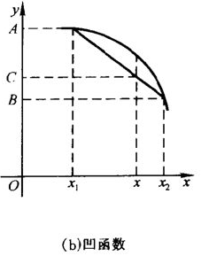
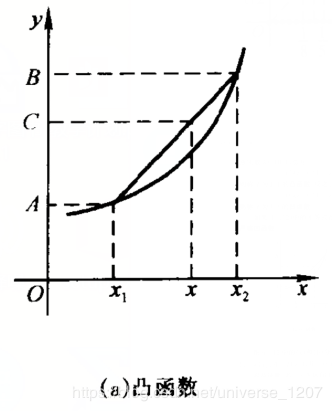
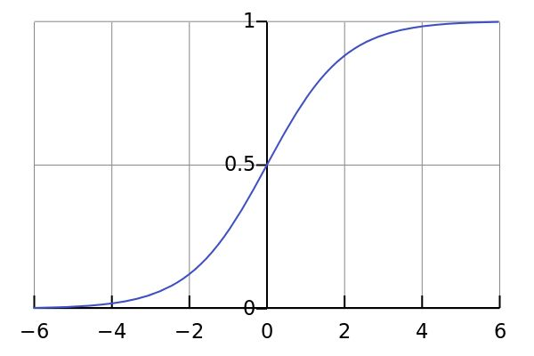

# 深度学习数学基础(一)

机器学习以及深度学习的学习和应用过程需要一定的数学知识，这就要求学习者掌握一定的数学知识，虽然说大多数知识已经在大学的前置数学课程中学习过了，但由于鄙人不够用心，学得差不多都还给老师了，就在这里做一个梳理和总结，以方便后续知识的学习。

**所需的数学知识：**

- 高等数学/微积分
- 线性代数与矩阵论
- 概率论与信息论
- 最优化方法
- 图论/离散数学

## 一、微积分

### 1.1 函数的部分性质

#### 1.1.1 上确界sup和下确界inf

​		一个实数集合*A*，若有一个实数*M*，使得*A*中任何数都不超过*M*，那么就称*M*是*A*的一个上界。即设有一实数集A⊂R，实数集A的上确界supA被定义为如下的数：

1. $\forall a\in A\Rightarrow a\le supA$(即supA是A的上界)
2. $\forall \epsilon>0,\exists a_0\in A\Rightarrow a_0>supA-\epsilon$

​        一个数集若有上界，则它有无数个上界；但是上确界却只有一个，这可以直观地从上确界（最小上界）的含义中看出来。并且如果一个数集若有上界，则它一定有上确界。

​	一个实数集合*A*，若有一个实数*N*，使得*A*中任何数都不超过*N*，那么就称*N*是*A*的一个下界。即设有一实数集A⊂R，实数集A的下确界infA被定义为如下的数：

1. $\forall a\in A\Rightarrow a\ge infA$(即supA是A的上界)
2. $\forall \epsilon>0,\exists a_0\in A\Rightarrow a_0<infA+\epsilon$

​        一个数集若有下界，则它有无数个下界；但是下确界却只有一个，这可以直观地从下确界（最大下界）的含义中看出来。并且如果一个数集若有下界，则它一定有下确界

#### 1.1.2 函数的单调性

​		深度学习中常要考虑到函数的单调性，如在神经网络的激活函数，AdaBoost算法中都需要研究函数的单调性。

#### 1.1.3 函数的极值

​		函数的极值在机器学习中有着及其重要的意义，这是因为大部分优化问题都是连续优化问题，因此可以通过求导数为0的点求得函数的极值，以实现最小化损失函数，最大化似然函数的目标。

#### 1.1.4 函数的凹凸性

​		函数的凹凸性在凸优化和Jensen不等式中都有所应用。

**函数凹凸性的定义：**

$f$定义在$I$上，若对$I$中的任意两点$x$~1~和$x$~2~和任意$\lambda\in (0,1)$:

- $f(\lambda x_1+(1-\lambda)x_2)\le \lambda f(x_1)+(1-\lambda )f(x_2)$，则称$f$为$I$上的凹函数(去掉等号是严格凹函数)

- $f(\lambda x_1+(1-\lambda)x_2)\ge \lambda f(x_1)+(1-\lambda )f(x_2)$，则称$f$为$I$上的凸函数(去掉等号是严格凸函数)

        

**相关定理：**

1. $f$为$I$上的凸函数，对任意三点$x_1<x_2<x_3$，总有$\frac {f(x_2)-f(x_1)}{x_2-x_1}\le\frac {f(x_3)-f(x_1)}{x_3-x_1}\le\frac {f(x_3)-f(x_2)}{x_3-x_2}$凹函数可以得到类似的结论。

2. $f$在$I$上可导，则以下论断等价：
   - $f$在$I$上为凸函数
   - $f^，$在$I$上单调递增
   - $\forall x1,x2\in I,f(x2)\ge f(x1)+f^,(x_1)(x_2-x_1)$
   
3. 若$f$在$I$上二阶可导，则$f$为凸函数$\iff $$f"(x)\ge 0$,$f$为凹函数$\iff $$f"(x)\le 0$

   注意！严格凸不能 $\Rightarrow $f&#x27;&#x27;(x)&gt;0,但是f''(x)>0$\Rightarrow$严格凸。

4. 设点$(x_0,f(x_0))$处有穿过曲线$y=f(x)$的切线，且切线两侧的曲线分别为严格凹与严格凸，则点$(x_0,f(x_0))$称为拐点。

**Jesen不等式：**

$f$为$[a,b]$上的凸函数，则对

$\forall x_i\in[a,b],\forall\lambda_i>0,\sum_{i=1}^n\lambda_i=1$，

都有$f(\sum_{i=1}^n\lambda_ix_i)\le\sum_{i=1}^n\lambda_if(x_i)$

#### 1.1.4 **Lipschitz连续性**

​		这一概念在工科的课本中很少出现，但对分析函数的性质有很大的帮助，在GAN、深度学习算法稳定性、泛化性能分析等方面都有很好的效果。

​         在数学，特别是实分析中，lipschitz条件，即利普希茨连续条件、是一个比通常连续更强的光滑性条件。直觉上，利普希茨连续函数限制了函数改变的速度，符合利普希茨条件的函数的斜率，必小于一个称为利普希茨常数的实数（该常数依函数而定）。
​		在微分方程，利普希茨连续是皮卡-林德洛夫定理中确保了初值问题存在唯一解的核心条件。一种特殊的利普希茨连续，称为压缩应用于巴拿赫不动点定理。
​		利普希茨连续可以定义在度量空间上以及赋范向量空间上；利普希茨连续的一种推广称为赫尔德连续。

**定义：**

对于在实数集的子集的函数$f:D\subseteq R\rightarrow R,$若存在常数$K$,使得$\forall a,b\in D, |f(a)-f(b)|\le K|a-b|$则称$f$符合利普希茨条件，符合条件的最小的$K$称为$f$的利普希茨常数。若$k<1$，$f$称为收缩映射。

**皮卡-林德洛夫定理：**

若已知$y(t)$有界，符合利普尼茨条件，则微分方程初值问题$y'(t)=f(t,y(t)),y(t0)=y0$刚好有一个解。

在应用上，$t$通常属于一有界闭区间（如[0,2π]）于是$y(t)$必有界，故$y$有唯一解。

### 1.2 导数

#### 1.2.1导数的定义

​		要明晰导数的基本定义，理解其几何含义，还要注意多元函数中的偏导数，理清基本的概念对于构建一个完整的知识框架很有必要。

#### 1.2.2 基本求导公式

​        自行记忆即可

#### 1.2.3 链式求导（复合求导法则）

各类神经网络的反向传播算法都依赖于链式法则。

**链规则：**设$y=y(u)$在点$u_0$处可导，$u=u(x)$在点$x_0$处可导，$u_0=u(x_0)$则复合函数$y=y(u(x))$在点处可导，且$(y(u(x)))'|_{x=x_0}=y'(u_0)u'_x|_{x=x_0}$

或$y'_x|_{x=x0}=y'_u|_{u=u0}u'_x|_{x=x0)}$

#### 1.2.4 sigmoid函数求导与梯度消失

Sigmoid函数即（logistic函数）,函数形式为：$S(x)=\frac{1}{1+e^{-x}}$

如图可知，该函数具有如下的特性：当x趋于负无穷时，y趋近与0；当x趋近于正无穷时，y趋近于1；x=0时，y=0.5。

该函数的优点：

1. sigmoid函数的输出映射在（0,1）之间，单调连续，输出范围有限，优化稳定，可以用作输出层。神经网络中常会有sigmoid平滑层。
2. 求导简单方便

缺点：

1. 由于其软饱和性，容易产生梯度消失，导致训练过程出错。
2. 其输出并不是以0为中心，关于原点对称的。

应用：

​		logistic函数在统计学和机器学习领域应用最为广泛的便是逻辑回归模型。逻辑回归模型（简称LR）作为一种对数线性模型，被广泛的应用到分类与回归场景中。此外，神经网络中最为常用的激活函数就是sigmoid函数。

### 1.3  梯度

#### 1.3.1 梯度的定义

​		设函数$z=f(x,y)$在点$(x_0,y_0)$的某个邻域内有定义。设$y=y_0$则一元函数$f(x,y_0)$在点$x=x_0)$处可导，即极限 $$\lim\limits_{\Delta x\rightarrow 0}\frac{f(x_0+\Delta x,y_0)-f(x_0,y_0)}{\Delta x}=A$$。则称$A$为函数$z=f(x,y)$在点处关于自变量x的偏导数。记做$f_x(x_0,y_0)$。

公式：设函数$z=f(x,y)$在平面区域$D$内具有一阶连续偏导数，则对于每个点$p(x,y)\in D$，向量$(\frac {\partial f}{\partial x},\frac {\partial f}{\partial y})$为函数  在点P的梯度，记做$gradf(x,y)$。

含义：梯度方向就是函数在该点变化最快的方向。

应用：在深度学习中，用梯度下降（或者梯度上升）来求损失函数$f(\theta)$的最小值（或者$-f(\theta)$的最大值。

#### 1.3.2 梯度的几何意义

$\frac {\partial f}{\partial x}|_{x=x_0,y=y_0}=\frac{d}{dx}f(x,y_0)|_{x=x_0}$是曲线$\begin{cases}z=f(x,y)\\y=y_0\end{cases}$，在点$M_0$处的切线$M_0T_y$对$x$轴的斜率。

#### 1.3.3 方向导数定理

如果函数$z=f(x,y)$在点$P(x,y)$是可微分的，那么在该点沿任意方向L的方向导数都存在。

$\frac{\partial f}{\partial l}=\frac{\partial f}{\partial x}cos\phi+\frac{\partial f}{\partial y}sin\phi$，其中为x轴到L的角度。

#### 1.3.4 偏微分方程

在某些理论推导中可能会使用，如变分法中的欧拉-拉格朗日方程。

### 1.4 微分定理相关

#### 1.4.1 泰勒公式

这是一个核心知识点。泰勒公式在优化算法中广泛使用，从梯度下降法，牛顿法，拟牛顿法，到AdaBoost算法，梯度提升算法，XGBoost的推导都离不开它。

若$f(x)$在$(a,b)$内有$(n+1)$阶导数，那么对$x\in(a,b)$有

$f(x)=f(x_0)+f'(x_0)(x-x_0)+\frac{1}{2!}f"(x_0)(x-x_0)^2+……+R_n(x)$

其中，$R_n(x)=\frac{f^{n+1}(\xi)}{(n+1)!}(x-x_0)^{(n+1)}$$\xi$是$x$与$x_0$之间的某值，$R_n(x)$称为拉格朗日余项。

1. 利用泰勒公式可以逼近函数曲线。其利用了幂函数的导数特性：n阶幂函数除了第n阶，其他阶导数为0。
2. 泰勒公式越接近$x_0$点的函数，与原函数接近。

#### 1.4.2 拉格朗日中值定理

若$f(x)$在 $[a,b]$上连续，在$(a,b)$内可导，则$\exists \xi \in (a,b)$使$f'(\xi)=\frac{f(b)-f(a)}{b-a}$(利用罗尔定理证明）

#### 1.4.3 柯西中值定理

设函数$f(x),g(x)$满足条件：

1. 在$[a,b]$上连续
2. 在$(a, b )$内可导且$f'(x),g'(x)$均存在，且$g'(x)\neq 0$

则在$(a,b)$内存在一个$\xi$，使$\frac{f(b)-f(a)}{g(b)-g(a)}=\frac{f'(\xi)}{g'(\xi)}$

### 1.5 积分

#### 1.5.1 牛顿-莱布尼茨公式

若$f(x)$在$[a,b]$上连续，函数$F(x)$在$[a,b]$上是$f(x)$的一个原函数，则：$\int_a^bf(x)dx=F(b-F(a))$

#### 1.5.2 变上限积分

分布函数是典型的变上限积分，主要用于概率计算。

#### 1.5.2 多重积分

主要用于概率论中，计算随机变量的积分，如正态分布等

### 未完待续

### 参考文献

- https://zhuanlan.zhihu.com/p/81834108

  

  